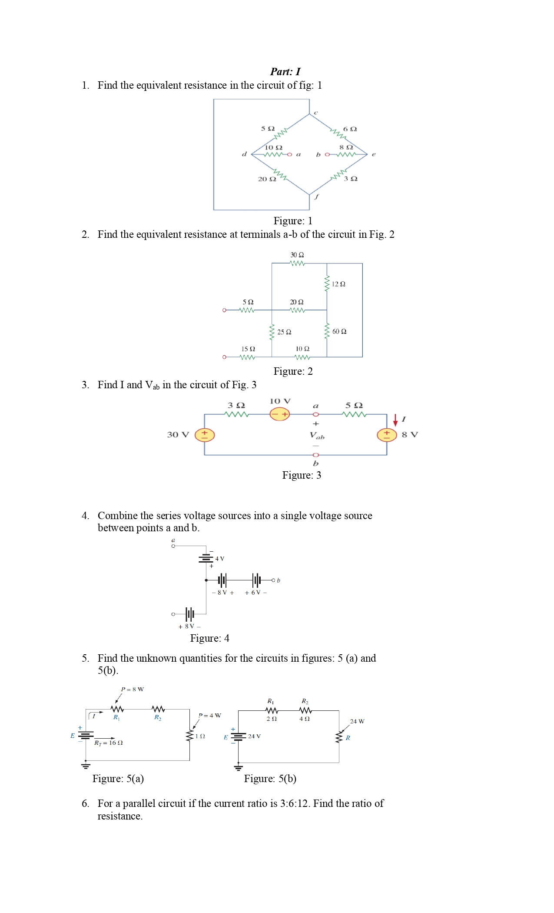
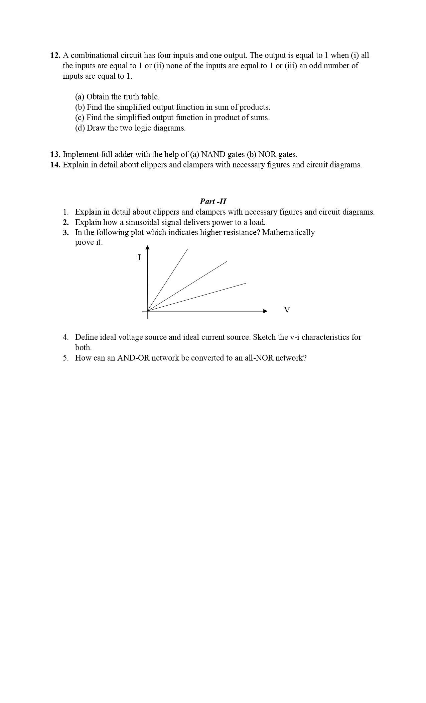
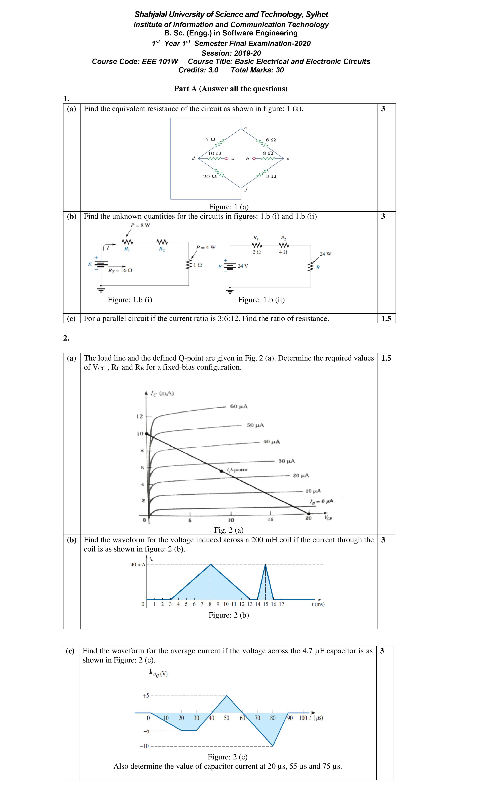
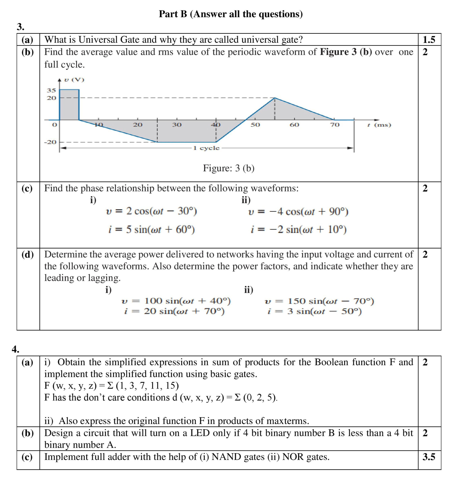

<h2><u>Assignment: 14th June, 2020</u></h2>

**Topic: Capacitors and Inductors**

1. Make a group of three.
2. Make a slide on Capacitors and Inductors. It should include the following:
    * Working Principle
    * Derivation of the current-voltage relationship
3. You may use any book you find appropriate.
4. If any copy is found between the slides prepared by the groups there will be penalty of 5 marks for each of the members of both the groups.
5. The best two slides would receive a +2 marks bonus.
6. At the end of the slide there should be a mention of the individual contribution made by the members. Each member would receive marks according to their contribution.

 <h2><u>Term Test-1: 15th December, 2020</u></h2>

Page 1

 Page 2 

 Page 3 

 <h2><u>Final: 17th July, 2021</u></h2>

Page 1

 Page 2 

