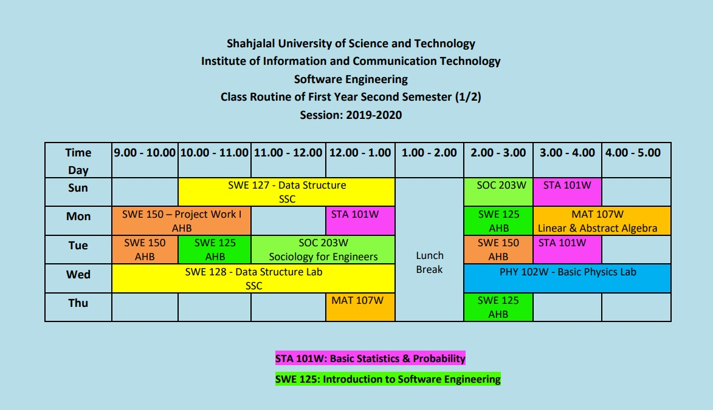

<h2 align = "center">Class Routine</h2> 

 

## [⭐Question⭐](/Question/2ndSemester)

## [⭐Syllabus⭐](Syllabus.pdf)

 

<h2 align = "center"> Final Exam Routine (Theoretical) </h2> 

| Date | Course No. | Course Name|
| :-- | :--: | :-- |
| 17th August, 2021 | SWE 127 | Data Structure |
| 23rd August, 2021 | SWE 125 | Introduction to Software Engineering |
| 29th August, 2021 | MAT 107W | Linear and Abstract Algebra |
| 2nd September, 2021 | STA 101W | Basic Statistics and Probability |
| 6th September, 2021 | SOC 203W | Sociology for Engineers |

