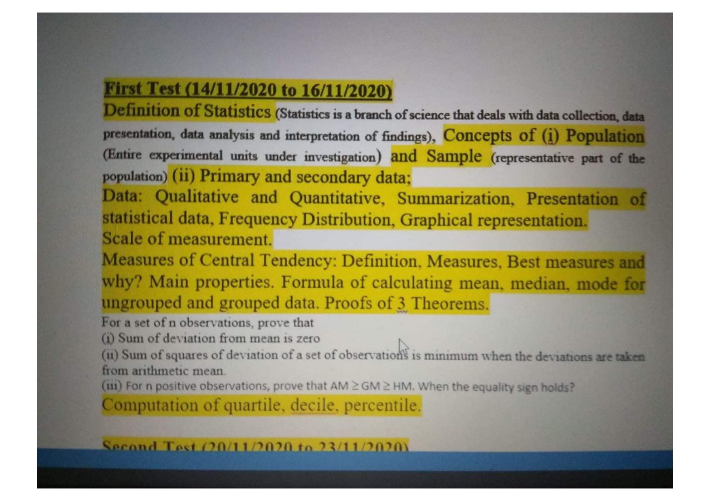
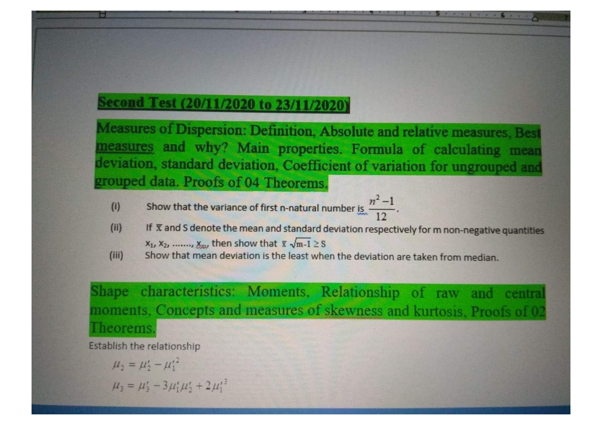
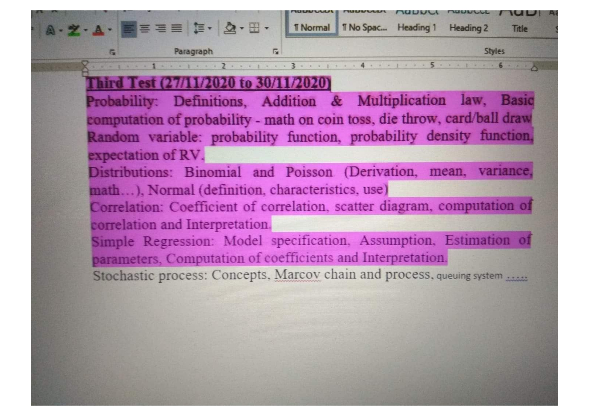
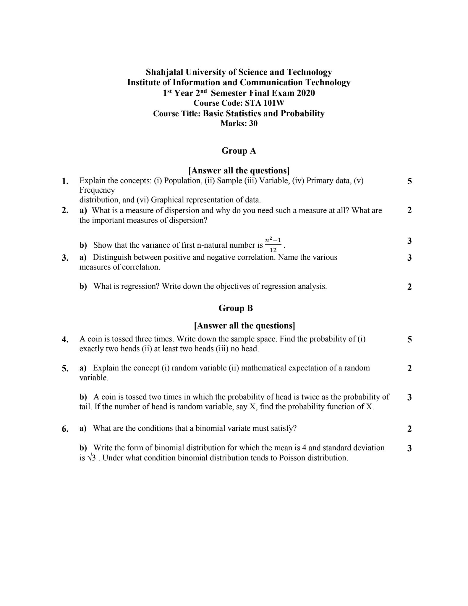

<h2><u>Term Test-1: 14th November, 2020</u></h2>

 <h2><u>Term Test-2: 20th November, 2020</u></h2>

 <h2><u>Term Test-3: 27th November, 2020</u></h2>

 <h2><u>Final: 2nd September, 2021</u></h2>

