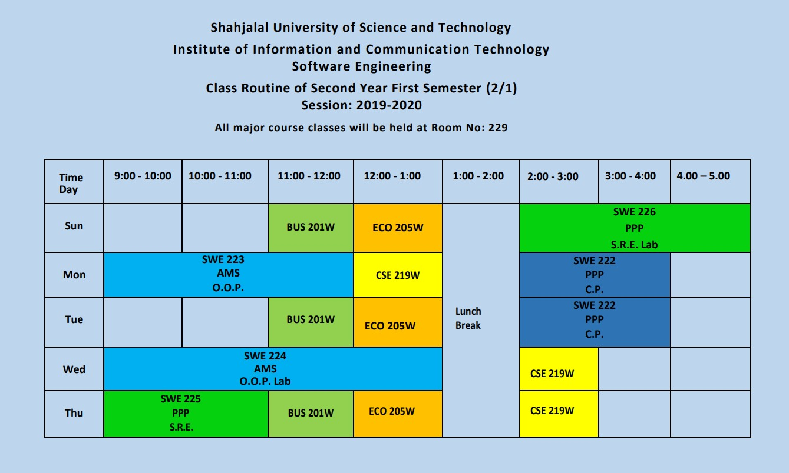

<h2 align = "center">Class Routine</h2> 

 

## [⭐Question⭐](/Question/3rdSemester)
## [⭐Syllabus⭐](Syllabus.pdf)

 

<h2 align = "center"> Final Exam Routine (Theoretical) </h2> 

| Date | Course No. | Course Name|
| :-- | :--: | :-- |
| 21st July, 2022 | SWE 223 | Object Oriented Programming|
| 25th July, 2022 | SWE 225 | Software Requirement Engineering |
| 31st July, 2022 | BUS 201W | Cost & Management Accounting |
| 4th August, 2022 | ECO 205W | Principles of Economics |
| 8th August, 2022 | CSE 219W | Computer Architecture |

