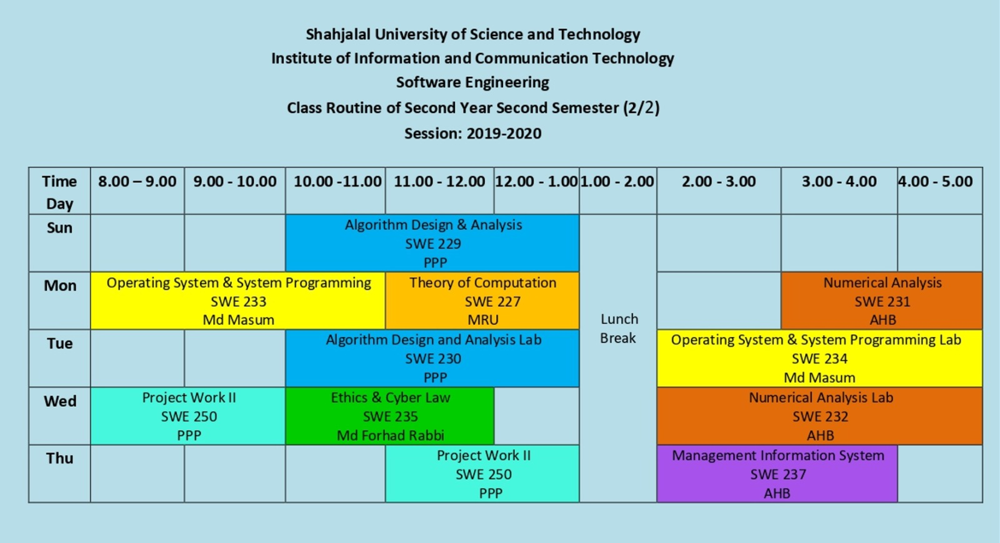

<h2 align = "center">Class Routine</h2> 

 

## [⭐Question⭐][ques]

## [⭐Syllabus⭐][syl]

 

<h2 align = "center"> Final Exam Routine (Theoretical) </h2> 

| Date | Course No. | Course Name|
| :-- | :--: | :-- |
| 18th December, 2022 | SWE237 | Management Information System|
| 5th January, 2023 | SWE235 | Ethics & Cyber Law |
| 9th January, 2023 | SWE229 | Algorithm Design & Analysis |
| 12th January, 2023 | SWE227 | Theory of Computation |
| 16th January, 2023 | SWE231 | Numerical Analysis |
| 21st January, 2023 | SWE233 | Operating System |

[ques]: https://drive.google.com/drive/folders/1N_fFFtu3ToYbYnjzggr9rlbCrxh4qigB?usp=share_link
[syl]: https://drive.google.com/file/d/1uw6eBIa8wutYj804tTEBESeK_M7xqyby/view?usp=share_link