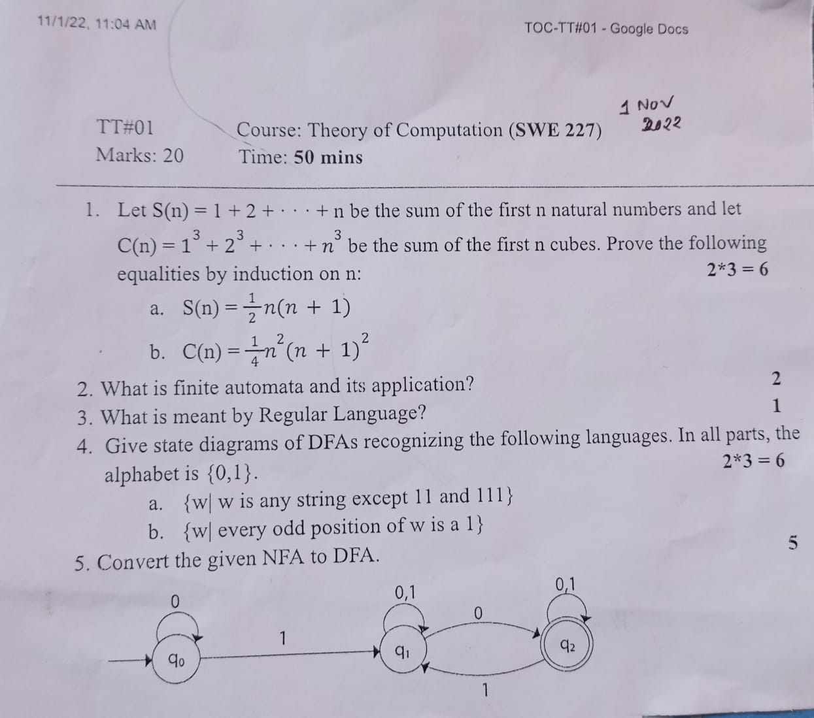
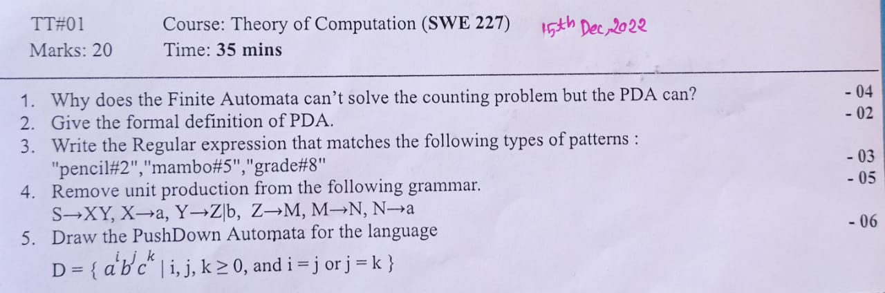
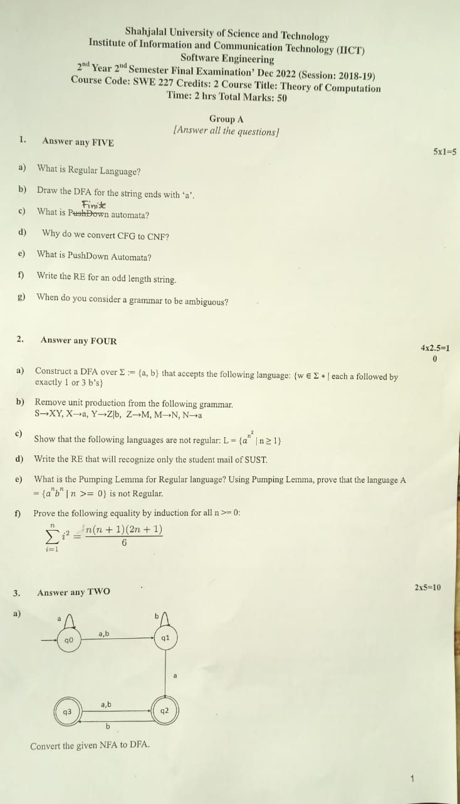
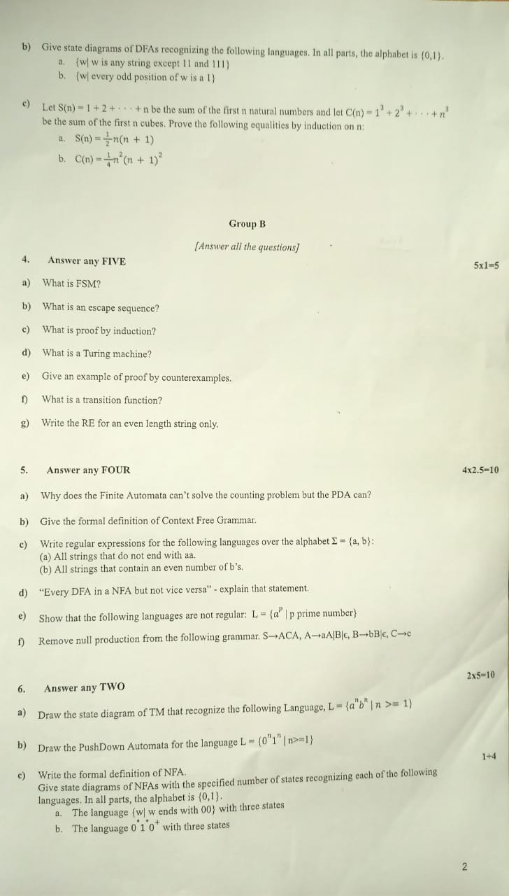

<h2><u>Term Test-1: 1st November, 2022</u></h2>

- Proof
- Automata
- Regular Language

 <h2><u>Term Test-2: 15th December, 2022</u></h2>
- Regular Expression
- Context Free Grammar
- Context Free Grammar to Chomsky Normal Form
- Pushdown Automata

 <h2><u>Final: 12th January, 2023</u></h2>

Page 1

 Page 2 

