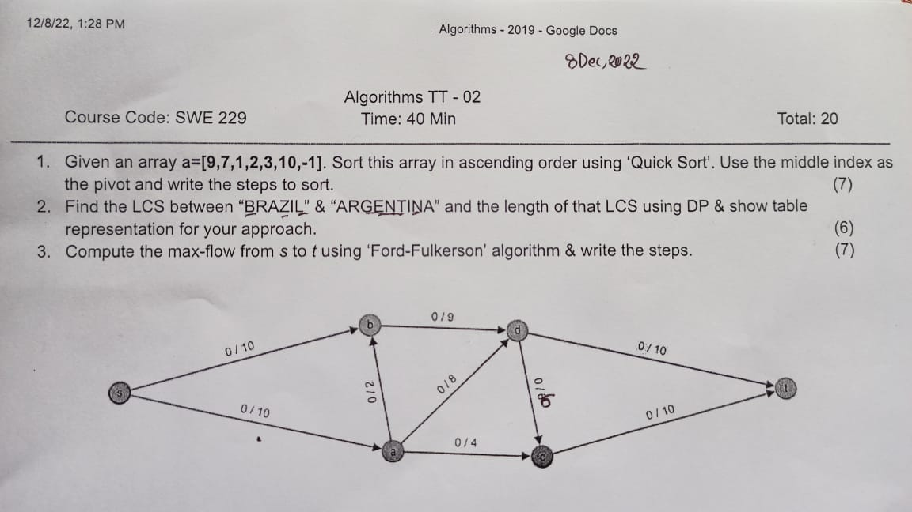
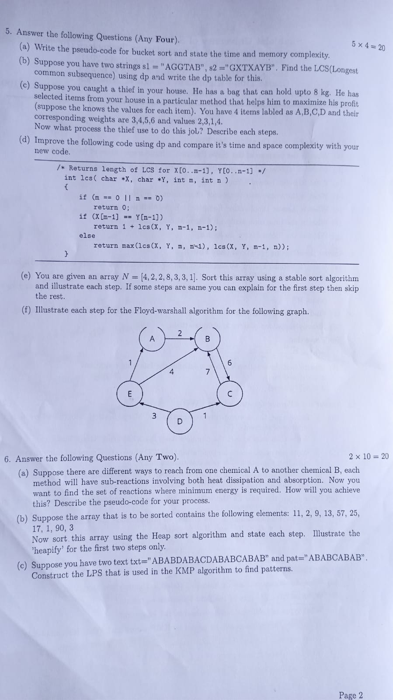

<h2><u>Term Test-1: 26th October, 2022</u></h2>

*Pseudo Code/Algorithm/Code*

1. Sieve & variations
2. Extended Euclid Algorithm
3. Modular Multiplicative Inverse
4. Chinese Remainder Theorem
5. Bellman Ford Algorithm
6. Floyd Warshall Algorithm

 <h2><u>Term Test-2: 8th December, 2022</u></h2>

1. **Sorting - Complexity Analysis & step by step Implementation**
    - Stable Sort (Counting, Bucket, Radix)
    - Heap Sort, Merge Sort, Quick Sort
2. **Ford Fulkerson**
3. **DP (0-1 knapsack, LCS)**

 <h2><u>Final Exam: 9th January, 2023</u></h2>

Page 1

 Page 2  

