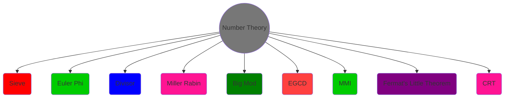
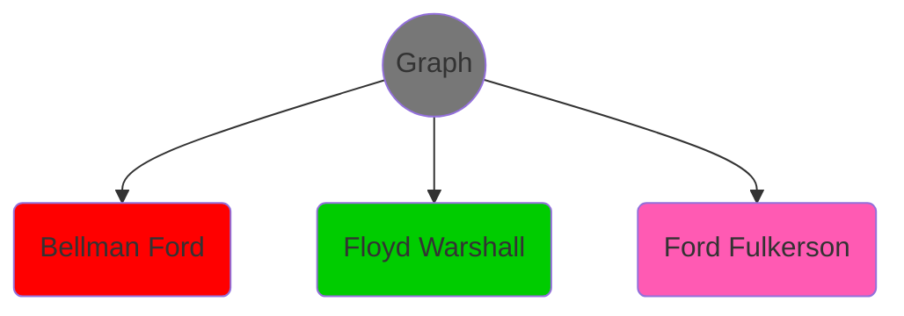
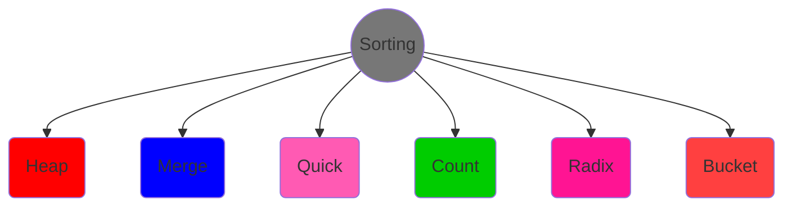
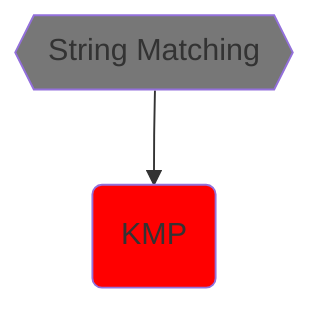
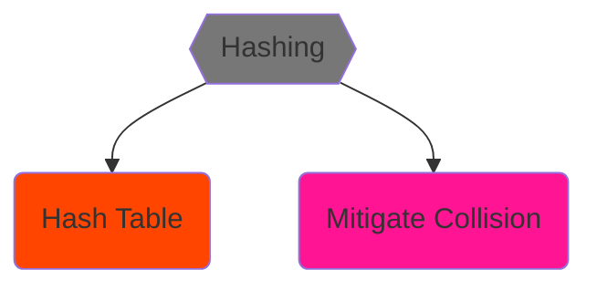
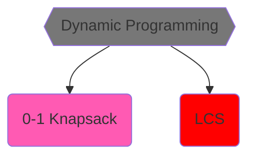

<h1 align="center"> Algorithm Design and Analysis </h1>

<h2> ⭐Contents⭐ </h2>

- [**Course Plan**](#course-plan)
- [**Resource**](#resource)
- [**Lectures**](#lecture-01-23rd-august-2022)
- [**Overview**](#overview)

<h2>Course Plan</h2>

>**Topics Completed** 

:white_check_mark: Sieve -> `Eratosthenes, Linear, Bitwise, Segmented` 
:white_check_mark: Divisors -> `Count & Sum` 
:white_check_mark: Euler Phi / Totient 
:white_check_mark: Modular Inverse -> `with Power, with Extended Euclid` 
:white_check_mark: Chinese Remainder Theorem -> `Extended Euclid`

:white_check_mark: Floyd Warshall 
:white_check_mark: Bellman Ford 
:white_check_mark: Max Flow -> `Ford Fulkerson`

:white_check_mark: Count Sort, Radix Sort, Bucket Sort 
:white_check_mark: Heapify, Heapsort

:white_check_mark: Hash Table, Hashing

:white_check_mark: DP: `Top Down -> Recursive`, `Bottom Up -> Iterative` 
:white_check_mark: 0-1 Knapsack 
:white_check_mark: Longest Common Subsequence

:white_check_mark: String Matching -> `KMP, Suffix Array`

 

>**Topics Not Completed** 

Strongly Connected Component 
Binary Search Tree 
Balanced Binary Search Tree - Treap / AVL Tree 

Matrix Chain Multiplication, CoinChange 
Greedy - Task Scheduling 

Rabin Karp 
Order Statistics 
Fast Fourier Transform

 

>**Topics Completed in CP Course** 
- [x] Quicksort
- [x] DSU
- [x] MST
- [x] Dijkstra
- [x] DFS 
- [x] BFS

 <h2>Resource</h2>

**Site :** [CP Algorithms](https://cp-algorithms.com/), [GeeksForGeeks](https://www.geeksforgeeks.org/), [Shafaet's Planet](https://www.shafaetsplanet.com/), [ForthRight48](https://forthright48.com/)

**Book :** 
- Introduction to Algorithms - CLRS
- Problem Solving Methods in Combinatorics
- Algorithms - Sedgewick, Wayne

[✅**Book Link**][book]

[book]: https://drive.google.com/drive/folders/1-vVeZ3cfpp2E51r-7-GUzuG4GfATqp25?usp=share_link

 <h2><u>Lecture-01: 23rd August, 2022</u></h2>

1. [Sieve of Eratosthenes](https://cp-algorithms.com/algebra/sieve-of-eratosthenes.html)
2. Linear Sieve

 <h2><u>Lecture-02: 28th August, 2022</u></h2>

1. Bitwise Operation
    - [Bit Manipulation](https://forthright48.com/bit-manipulation)
2. [Bitwise Sieve](http://www.shafaetsplanet.com/?p=855)

 <h2><u>Lecture-03: 30th August, 2022</u></h2>

1. Segmented Sieve
    - [CP-Algorithm](https://cp-algorithms.com/algebra/sieve-of-eratosthenes.html#segmented-sieve)
    - [ForthRight48](https://forthright48.com/segmented-sieve-of-eratosthenes)

 <h2><u>Lecture-04: 4th September, 2022</u></h2>

1. Euler phi
2. Count of Divisor
3. Sum of Divisor
4. [Counting Divisors of a number in *O(n^(1/3))* Complexity](https://codeforces.com/blog/entry/22317)
5. Miller Rabin Primality Test

 <h2><u>Lecture-05: 6th September, 2022</u></h2>

1. BigMod / Modular Exponentiation
2. Extended Euclid (EGCD)
3. Modular Multiplicative Inverse (MMI)
4. Fermat's Little Theorem

Resource in CP Algorithm / ForthRight48

 <h2><u>Lecture-06: 11th September, 2022</u></h2>

1. Shortest Path 
2. Floyd Warshall

Resource in CP Algorithm / Shafaet's Planet

 <h2><u>Lecture-07: 18th September, 2022</u></h2>

1. Bellman Ford
2. [Chinese Remainder Theorem (CRT) - Weak Form](https://forthright48.com/chinese-remainder-theorem-part-1-coprime-moduli/)

 <h2><u>Lecture-08: 20th September, 2022</u></h2>

1. [Chinese Remainder Theorem (CRT) - Strong Form](https://forthright48.com/chinese-remainder-theorem-part-2-non-coprime-moduli/)

 <h2><u>Lecture-09: 25th September, 2022</u></h2>

1. Heap Sort (Heapify & Sorting)

 <h2><u>Lecture-10: 16th October, 2022</u></h2>

1. Stable Sort properties
2. Count Sort

Resource in GeeksForGeeks, Youtube etc.

 <h2><u>Lecture-11: 18th October, 2022</u></h2>

1. Primary info about Git operation.
2. Pull Request, Fork, Collaborations.
3. Sublime Merge

 <h2><u>Lecture-12: 23rd October, 2022</u></h2>

1. Radix Sort
2. Bucket sort

 <h2><u>Lecture-13: 30th October, 2022</u></h2>

Algorithm & Complexity Analysis

1. Merge Sort 
2. Quick Sort

Resource in GeeksForGeeks, Youtube etc.

 <h2><u>Lecture-14: 8th November, 2022</u></h2>

1. String Hashing
2. Ways to mitigate collision
    - Hashing With Chain
    - Linear Probing
    - Quadratic Probing
3. How to retrieve?
4. Why prime is used to mod?
5. Load Factor
    - [**Programiz - Hash Table**](https://www.programiz.com/dsa/hash-table)
    - [**Basics of Hash Table**](https://www.hackerearth.com/practice/data-structures/hash-tables/basics-of-hash-tables/tutorial/)
    - [**Hash Table**](https://datastructures.maximal.io/hash-tables/)
    - [**Hash Funciton**](https://medium.com/basecs/hashing-out-hash-functions-ea5dd8beb4dd)

 <h2><u>Lecture-15: 13th November, 2022</u></h2>

1. Hashing proof
2. Universal Hashing Function
3. Random Indicator
    - [**Hashing Note**](https://drive.google.com/file/d/1R0IkcmskBYAMTAThqsfcitaX_uacXdsT/view?usp=share_link)

 <h2><u>Lecture-16: 15th November, 2022</u></h2>

1. Ford Fulkerson for MaxFlow

 <h2><u>Lecture-17: 22nd November, 2022</u></h2>

1. 0-1 knapsack
2. Top Down/Recusive & Bottom Up/Iterative approach
3. Next Class: Coin Change, LCS
    - [**DP Resource**](https://takeuforward.org/dynamic-programming/striver-dp-series-dynamic-programming-problems/)

 <h2><u>Lecture-18: 4th December, 2022</u></h2>

1. Length of **Longest Common Subsequence (LCS)** with Top-Down & Bottom-Up approach

2. Print the Subsequence

Resource in GeeksForGeeks, Youtube etc.

 <h2><u>Lecture-19: 13th December, 2022</u></h2>

1. KMP
    - [**Resource**](https://www.scaler.com/topics/data-structures/kmp-algorithm/)

  

# Overview

 

 

 

 

 

