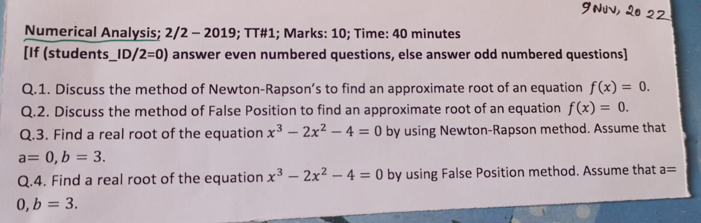
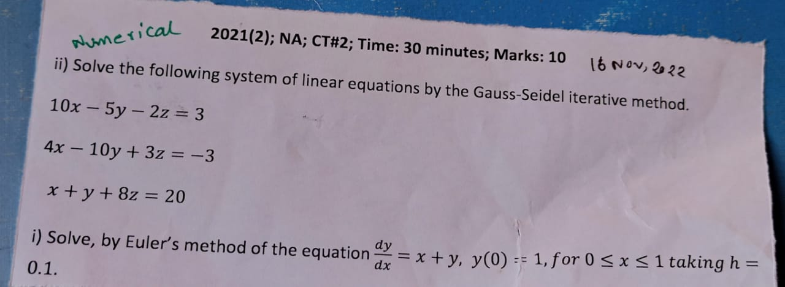
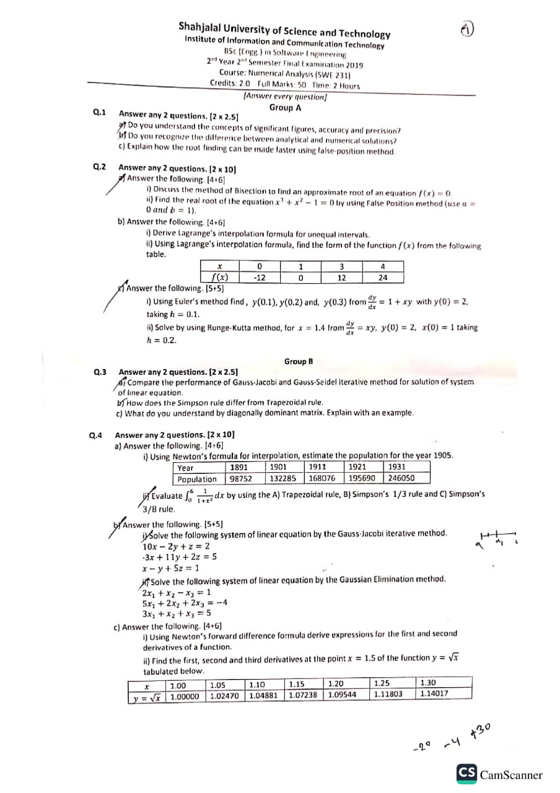
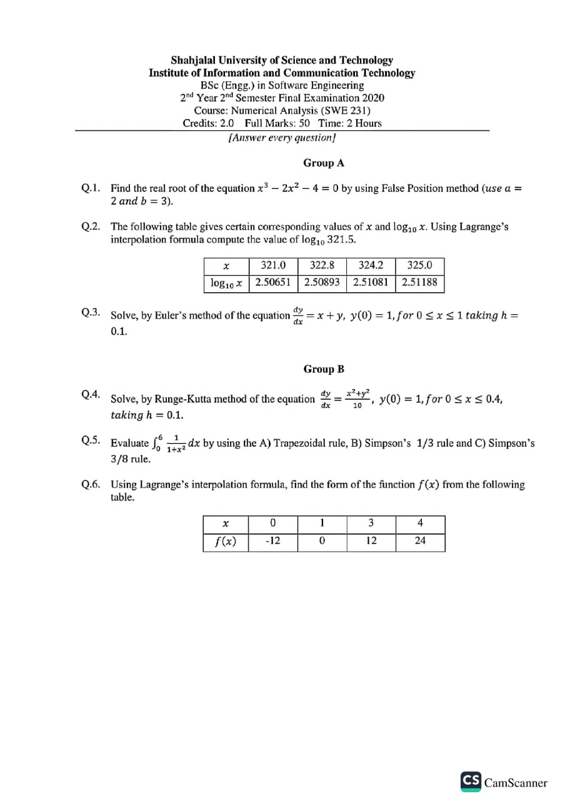

<b><u>Assignment: 8th November, 2022</u></b>
- Gaussian Elimination Method
- Gauss Jordan Method

 <b><u>Term Test-1: 9th November, 2022</u></b>

Root Finding Method
- Bisection
- False Position
- Newton-Raphson

 <b><u>Term Test-2: 16th November, 2022</u></b>

- ODE (Ordinary Differential Equation)
- SLE (System of Linear Equation)

 <b><u>Final: 16th January, 2023</u></b>

  <b><u>SWE 17 Final Exam Question</u></b>

 <b><u>SWE 18 Final Exam Question</u></b>

