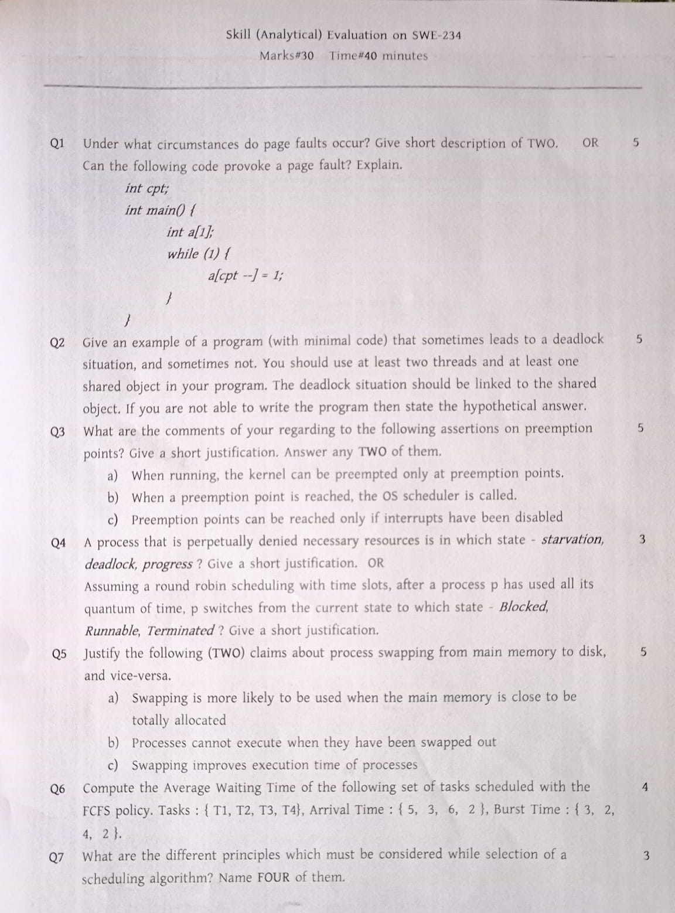
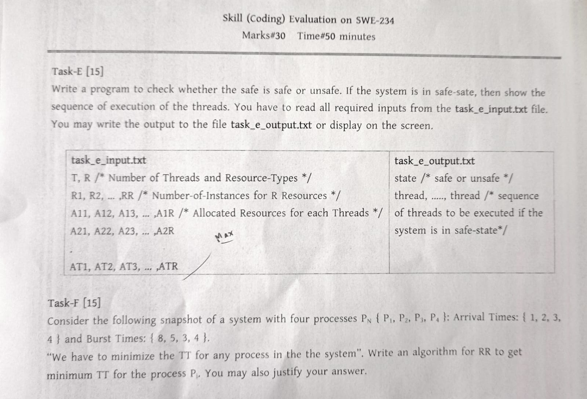
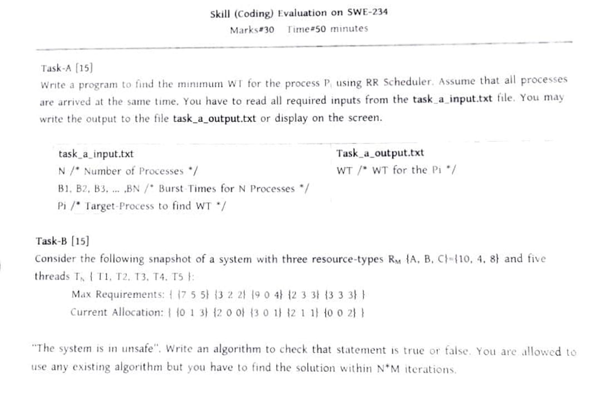

<h1 align="center">Operating System and System Programming Lab</h1>

⭐ Analytical and Coding part 
⭐ Scope
- Process Scheduling
- Deadlocks
- Memory Management

⭐ [**Sample Problem List for Lab Exam**](https://drive.google.com/file/d/199FPgzZvYwaJ9w-GGUmAvxIpMriBy9jR/view?usp=drive_link)
 
⭐ [**Code of various Scheduling algorithm and Deadlock detection**](https://drive.google.com/drive/folders/1txvpeF3I_K-6lgcBDpnAsHOhBnXOn6xz?usp=drive_link)

<b><u>Lab Final: 7th May, 2023</u></b>

Analytical Question :

 Coding Question 1 :

 Coding Question 2 :

