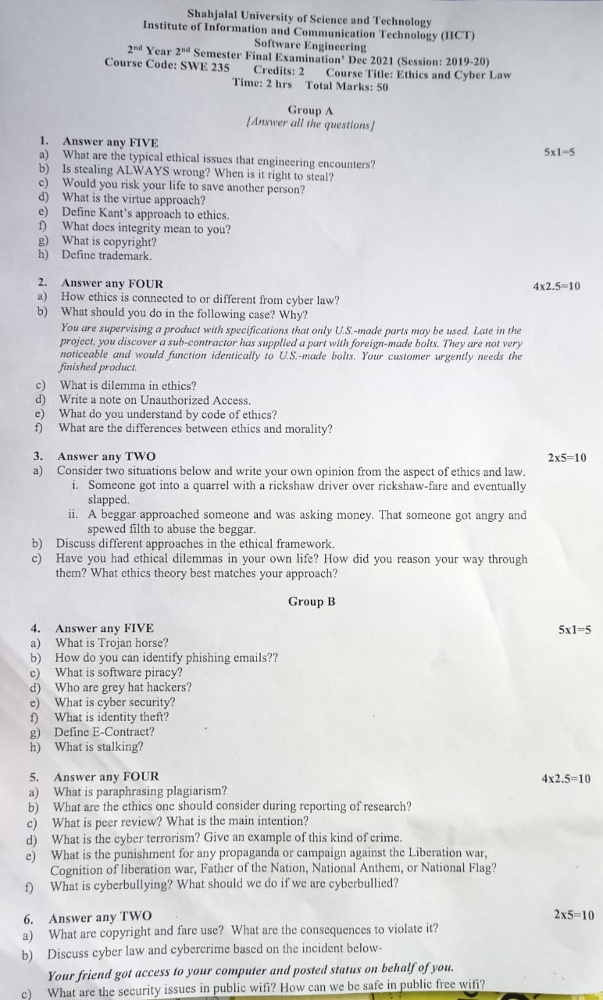
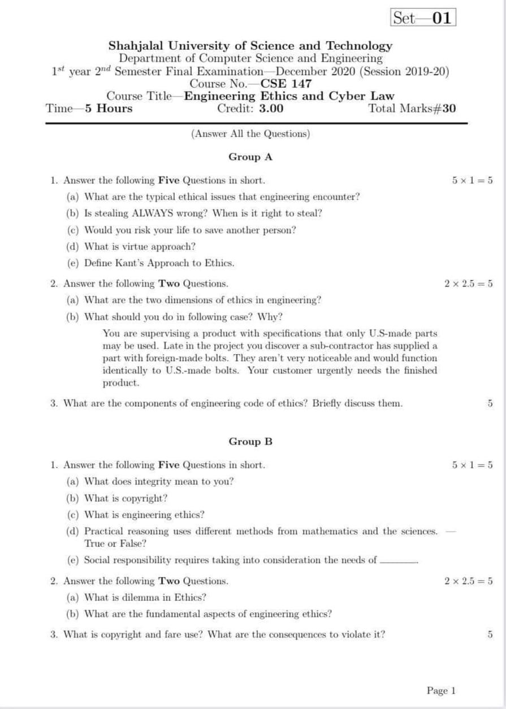
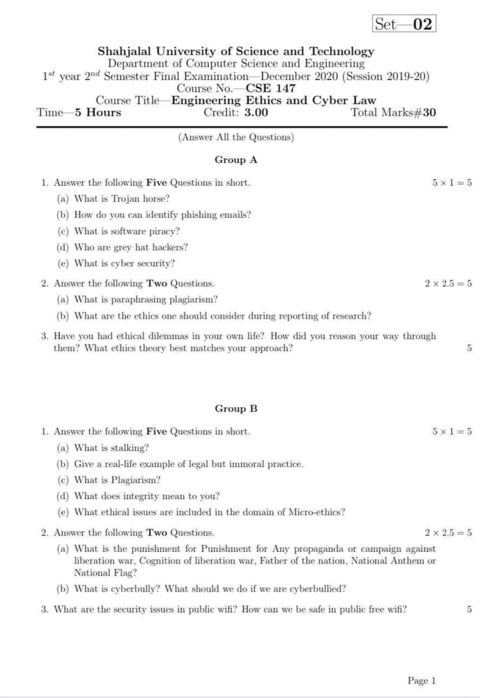
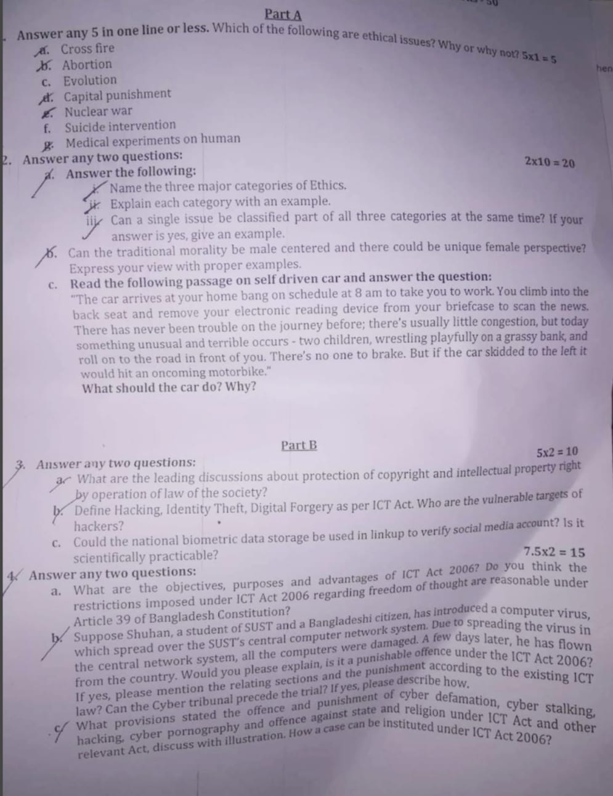

<b><u>Assignment: 12th December, 2022</u></b>

- [**Pentium Case**](https://drive.google.com/file/d/1gutuTDSxHWWHAJXulOhxx8JddsSUurkx/view?usp=share_link)

 <b><u>Term Test-1: 6th December, 2022</u></b>

- Ethics 1
- Engineering Ethics
- Plagiarism
- Ethics in Research

[✅**Resource Link**][res]

[res]: https://drive.google.com/drive/folders/1xbAdAcO6Gonb9jbSgoR8hthCyJW5evEc?usp=share_link

 <b><u>Final Exam: 5th January, 2023</u></b>

 <h2 align = "center"><i>Previous Question</i></h2>

 <b><u>CSE19 Final:</u></b>

**Set-1**

 

**Set-2**

 <b><u>CSE16 Final:</u></b>

