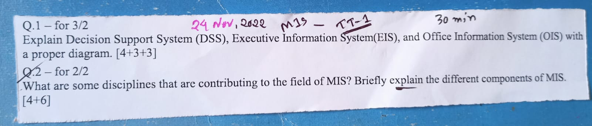
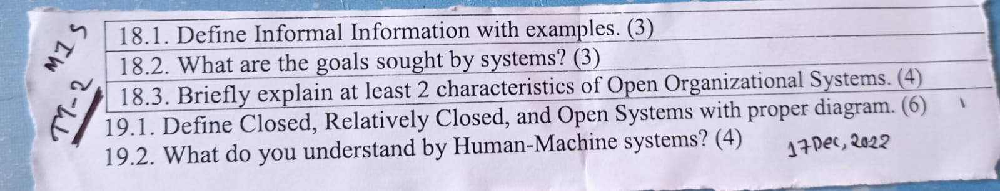
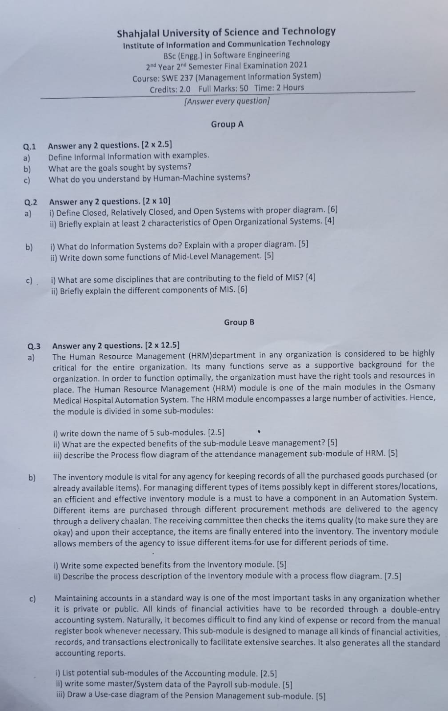

<b><u>Assignment: 20th November, 2022</u></b>

- From **Accounts** & **Inventory** Module, each group is assigned a Sub-Module.
- For each Sub-Module, draw **Use Case** & **Process Flow** Diagram

**My Sub-Module**
   - Managing Earned Revenue (Accounts Module)
   - Process Description (Inventory Module)

 <b><u>TT1: 24th November, 2022</u></b>
   - Part2 last 3 lectures

 

[✅**Resource Link for TT**][res]

[res]: https://drive.google.com/drive/folders/1XdCoKpLjEx_NQ-bsszALF51RavVtUNP0?usp=share_link

 <b><u>TT2: 17th December, 2022</u></b>
   - Part2 first 7 lectures

 <b><u>Final: 18th December, 2022</u></b>

