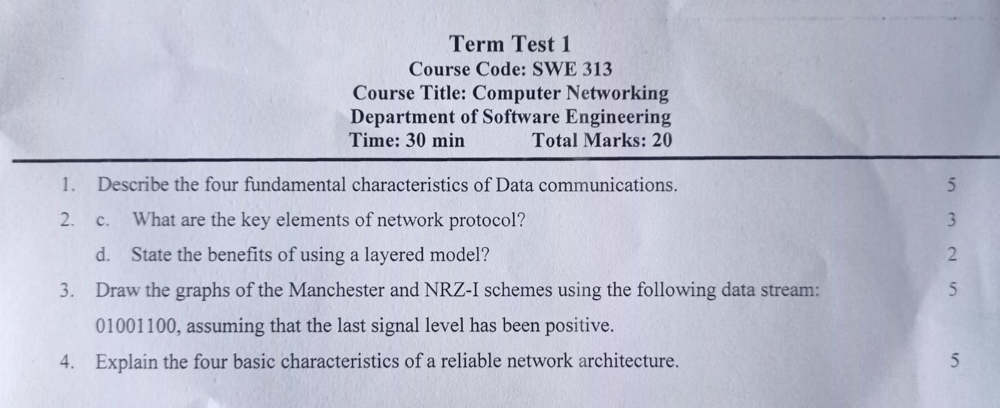
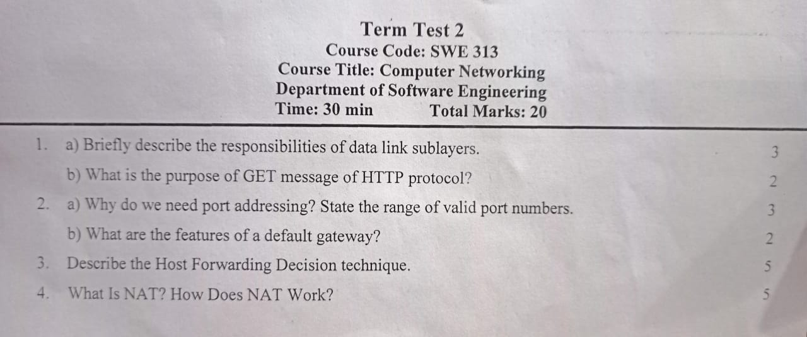
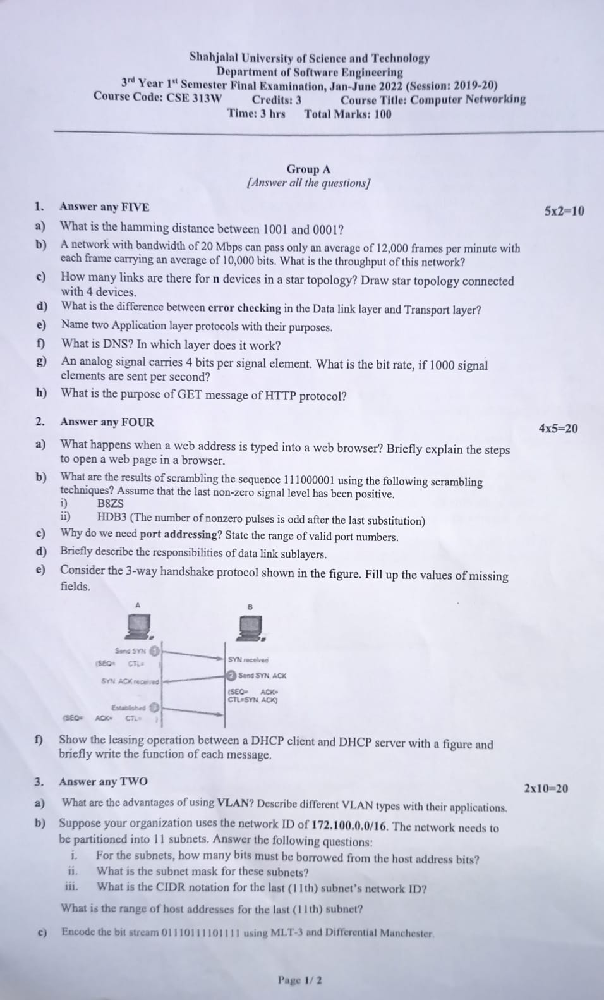
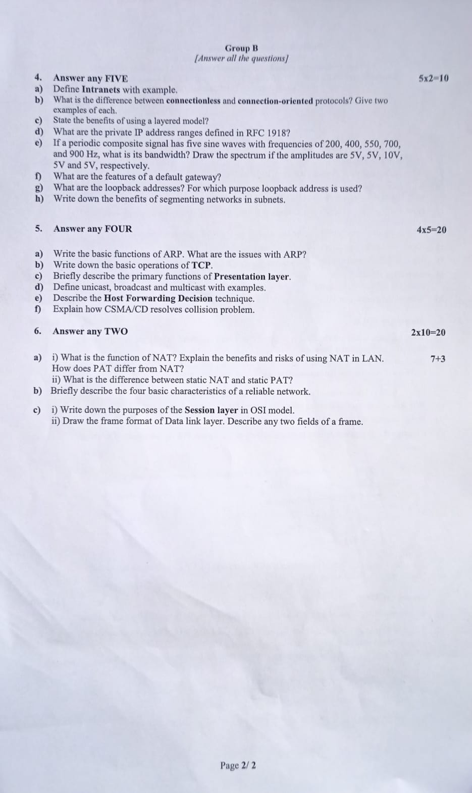

<b><u>Term Test-1: 28th May, 2023</u></b>

- 1st 2 Slide (Fundamentals)
- Chapter 1: Introduction
- Chapter 2: Network Models
- Chapter 3: Data and signals
- Chapter 4: Digital Transmission

 <b><u>Term Test-2: 18th June, 2023</u></b>

- Data Link Layer
- Network Layer
- Transport Layer
- Subnetting & VLan

 <b><u>Quiz-1: 20th June, 2023</u></b>

1. An analog signal carries 4 bits per signal element. What is the bit rate, if 1000 signal elements are sent per second?
2. A network with bandwidth of 20 Mbps can pass only an average of 12000 frames per minute with each frame carrying an average of 10000 bits. What is the throughput of this network?
3. What is the hamming distance between 1000 and 0001?
4. How many links are there for **n** devices in a star topology? Draw star topology connected with 4 devices.
5. What is the difference between error checking in the Data link layer and Transport layer?
6. What are the loopback addresses? For which purpose loopback address is used?
7. What are the reserved address ranges for private use?
8. Draw the frame format of Data link layer.
9. What are the private IP address range defined in RFC 1918?
10. What is the difference between connectionless and connection-oriented protocols? Give two examples of each.

 <h2>Final: 13th July, 2023</h2>

Page 1 :

 Page 2 : 

