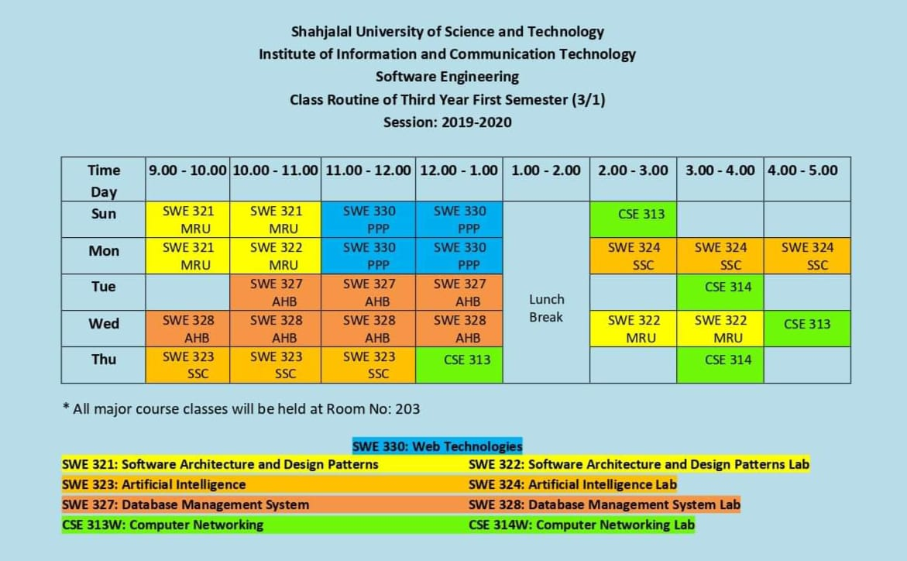

<h2 align = "center">Class Routine</h2> 

 

## [⭐Question⭐][ques]

## [⭐Syllabus⭐][syl]

[ques]: https://drive.google.com/drive/folders/1-z00v0KwscyUJ3OM9cfXhsnmbBxvQdM0?usp=share_link
[syl]: https://drive.google.com/file/d/17D3TA_ZTkBTeXb9tY33LRqyQGuua-AH5/view?usp=share_link