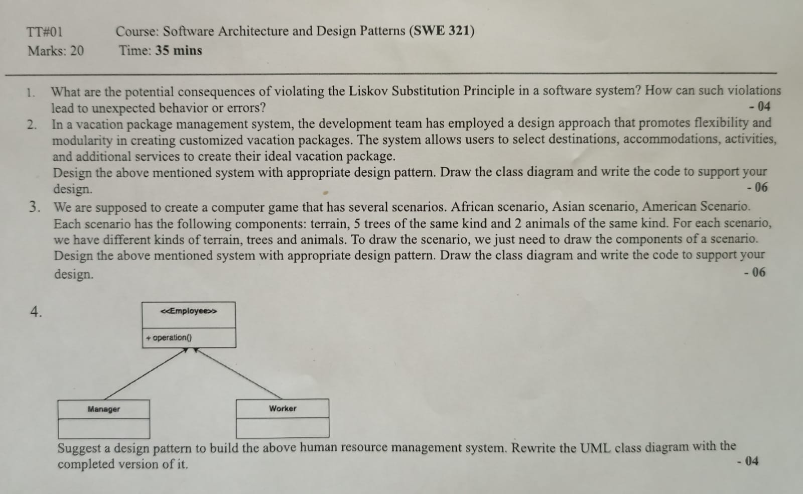
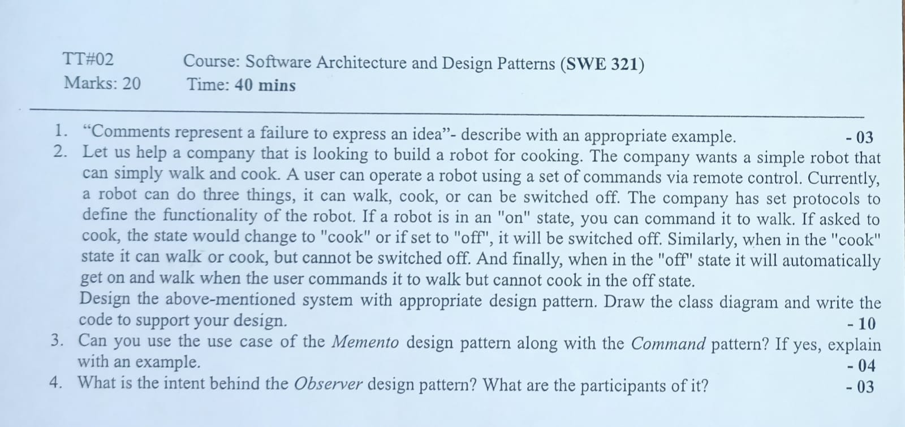

<b><u>Term Test-1: 25th May, 2023</u></b>

- UML Diagram
- Solid Principle
- Creational Design Pattern
    - Factory
    - Abstract Factory
    - Builder
    - Prototype
    - Singleton
- Structural Design Pattern
    - Adapter
    - Composite

 <b><u>Term Test-2: 14th June, 2023</u></b>

- Behavioral Design Pattern
    - Memento
    - State
    - Iterator
    - Strategy
    - Command
    - Observer
    - Chain of Responsibility
    - Visitor
- Code Smell & Refactoring
- Architectural Pattern

