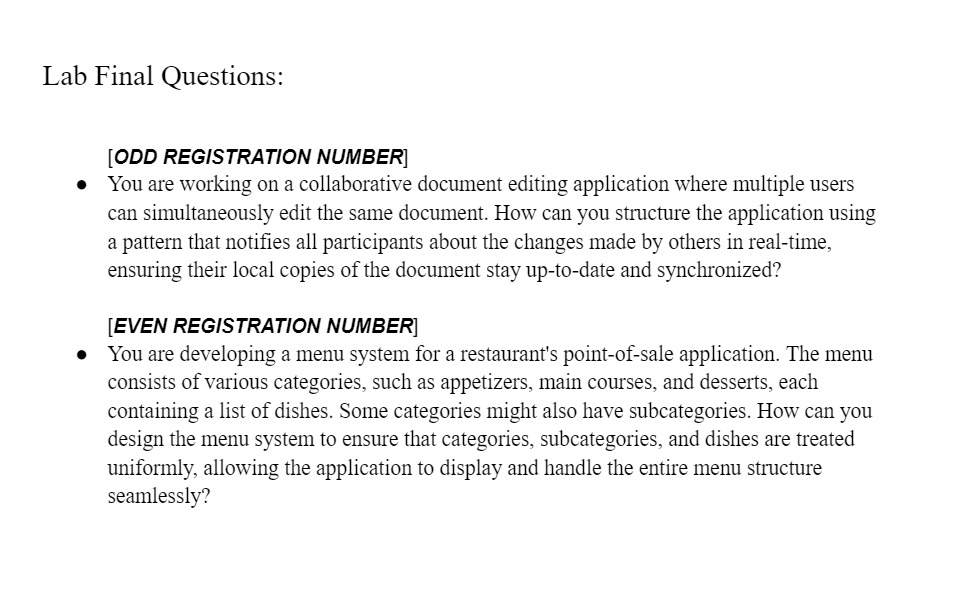

<h1 align="center">Software Architecture and Design Patterns Lab</h1>

**Assignments :**
- Java Code for [Class Diagram Example: Order System](https://www.visual-paradigm.com/guide/uml-unified-modeling-language/uml-class-diagram-tutorial/)
- A scenario where all SOLID principles are applied
- Builder Pattern - burgerBuilder
- Adapter Pattern - prototypexml (similar to jsonxml)
- Factory/Abstract Pattern - obstacle (space, asteroid)

**Site :** [Refactoring Guru](https://refactoring.guru/design-patterns)

[**⭐Design Pattern Code**](https://drive.google.com/drive/folders/1TDqmaQTpHy9AiWGZXbhWp-jAXKtxwGS0?usp=drive_link)

<b><u>Lab Final: 8th August, 2023</u></b>

Creational:
1. Factory Method
2. Abstract Factory
3. Builder

Structural:
1. Adapter
2. Composite
3. Facade

Behavioral:
1. Command
2. Chain of Responsibility
3. Observer
4. State
5. Memento

