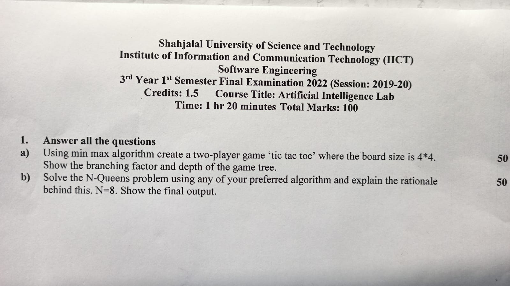

<h1 align="center">Artificial Intelligence - Lab</h1>

**Assignments :**
- A* implementation (python/c++)
-  Min-Max Implementation in Tic-Tac-Toe

**Tasks :**
- Depth Limited Search, Iterative Deepening Search
- Limitations of Hill Climbing Search in solving 8 Queens problem
- What to do in case of 2 admissible heuristics?
- Node & Arc Consistency
- Unary & Binary Constraints
- Genetic Algorithm

[**Code of various AI algorithm**](https://drive.google.com/drive/folders/1tWs4fPVC-rHa2HY8ccv_tw6WWptOjip2?usp=drive_link)

 <b><u>⭐Lab Final: 13th August, 2023</u></b>

**Topic :**
- DFS, BFS, Depth limited search
- Iterative deepening search
- Uniform Cost Search
- Bidirectional search 
- Greedy, A*
- Mini-max, Alpha-beta pruning
- Genetic algorithm

 <b><u>⭐Quiz: 16th August, 2023</u></b>

[**AI Lab Quiz**](https://drive.google.com/file/d/1Ee-NTU5XdBIGv9cfFL3Fsb0jTn-wbmWU/view?usp=drive_link)

 
 

<h2>Lab-01: 9th March, 2023</h2>

`Online`
- AI Intro, Field, Future!

 <h2>Lab-02: 25th May, 2023</h2>

`Online`
- Genetic Algorithm
- Fitness Value, Mutation, Crossing Over.
- [**Kaggle**](https://www.kaggle.com/) website

 <h2>Lab-03: 1st June, 2023</h2>

`Online`
- Min-Max
- Alpha-Beta Pruning

 <h2>Lab-04: 19th June, 2023</h2>

`Online`
- Python Basics