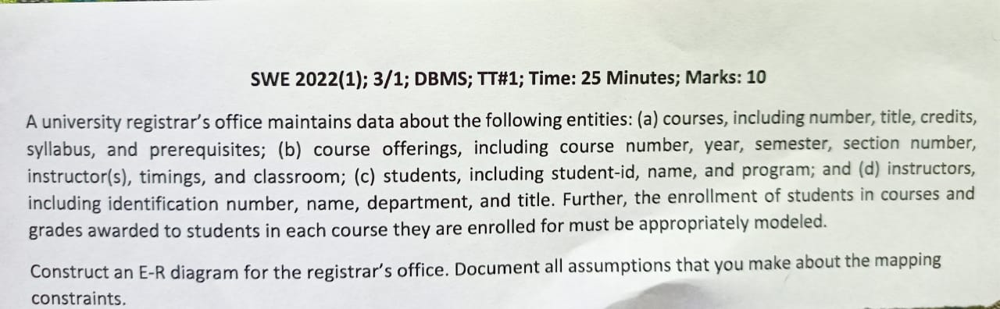
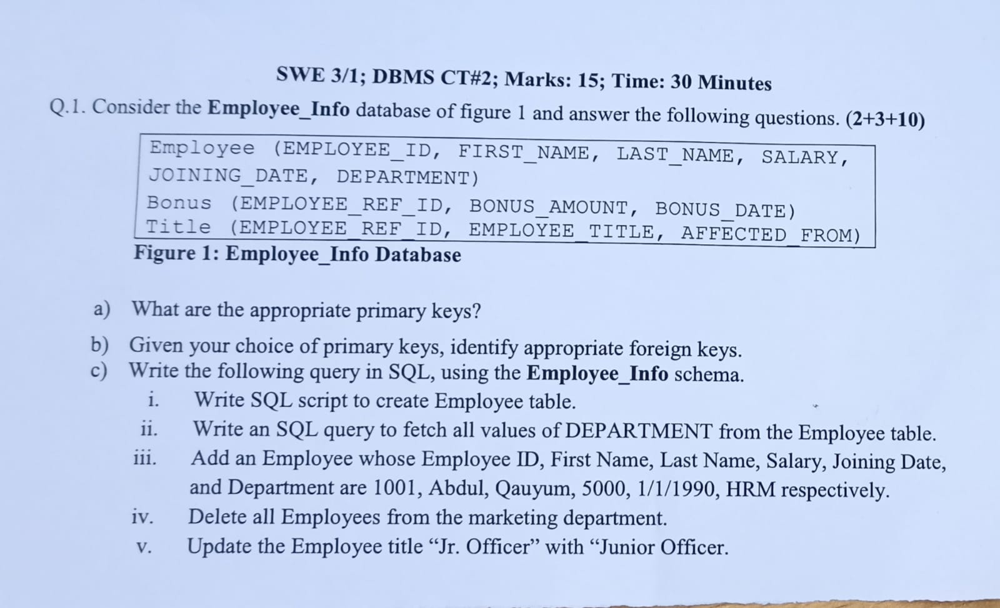
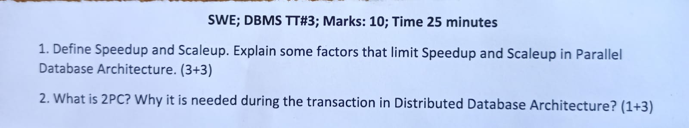

<b><u>Term Test-1: 9th May, 2023</u></b>

- Draw E-R Diagram from a given scenario

 <b><u>Term Test-2: 16th May, 2023</u></b>

- SQL commands

 <b><u>Term Test-3: 30th May, 2023</u></b>
- Database Normalization
- Database System Architecture

 <h2><u>Final: 9th July, 2023</u></h2>