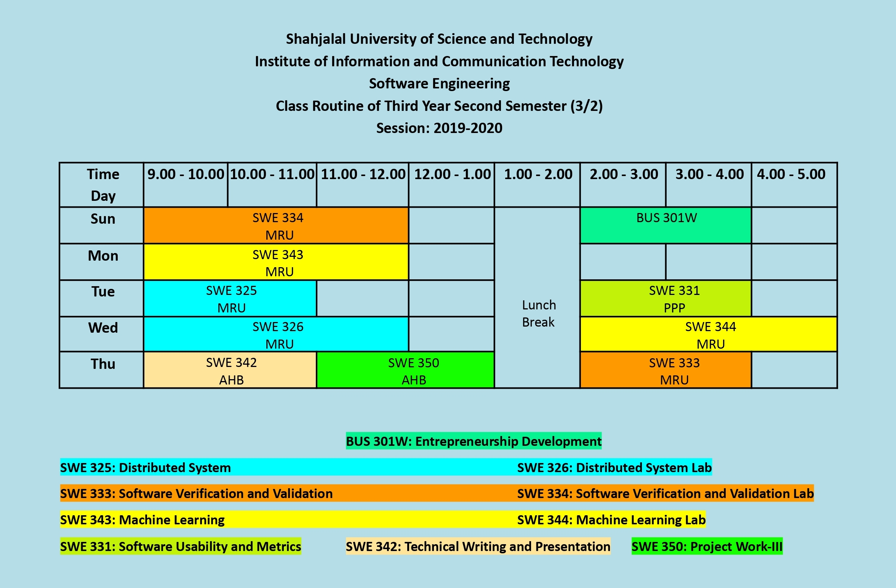

<h2 align = "center">Class Routine</h2> 

 

## [⭐Question⭐][ques]

## [⭐Syllabus⭐][syl]

[ques]: https://drive.google.com/drive/folders/10y4Im4hjRKrbvJ91q6oXPF43gD3y99gK?usp=drive_link
[syl]: https://drive.google.com/file/d/1KuBv7mmr-5Gn6xwvpUXj3h3nFTxrw3OA/view?usp=drive_link