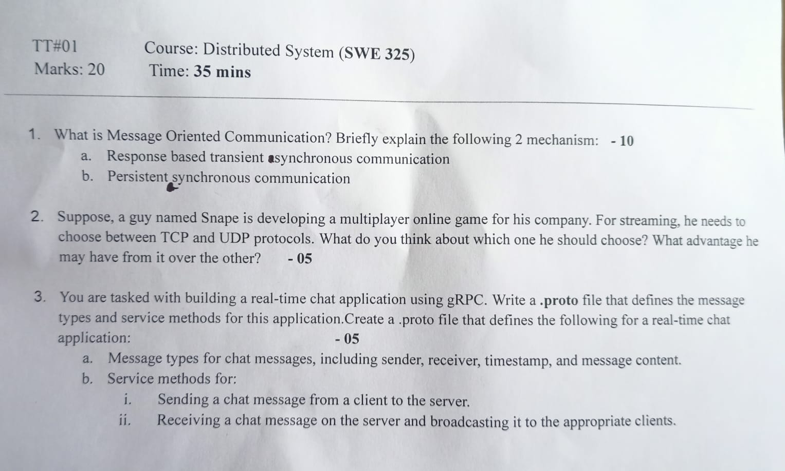
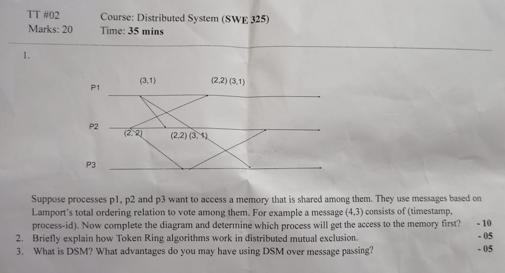
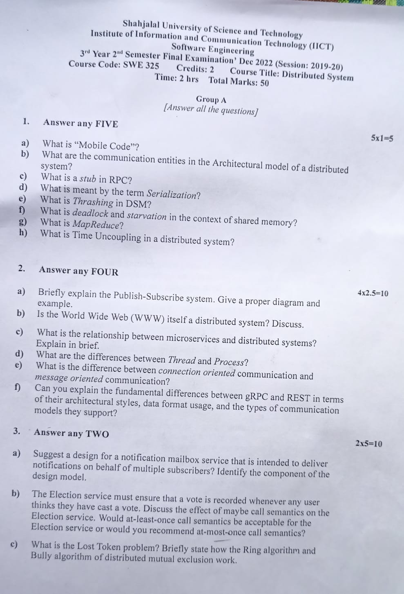
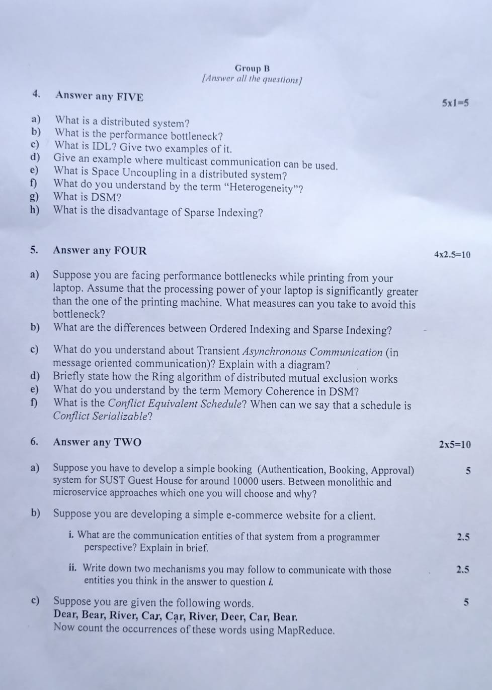

<h1 align="center">Distributed System</h1>

<b><u>Term Test-1: 18th October, 2023</u></b>

- Ch1 - Characteristic of Distributed System
- Ch2 - System Models
- Ch3 - Communication
- gRPC

 <b><u>Term Test-2: 25th November, 2023</u></b>

- Ch6 - Indirect Communication
- Distributed Shared Memory
- Ch8 - Synchronization in Distributed System
- Indexing
- B+ Tree

 <h2>Final: 3rd December, 2023</h2>

Page 1 :

 Page 2 : 

