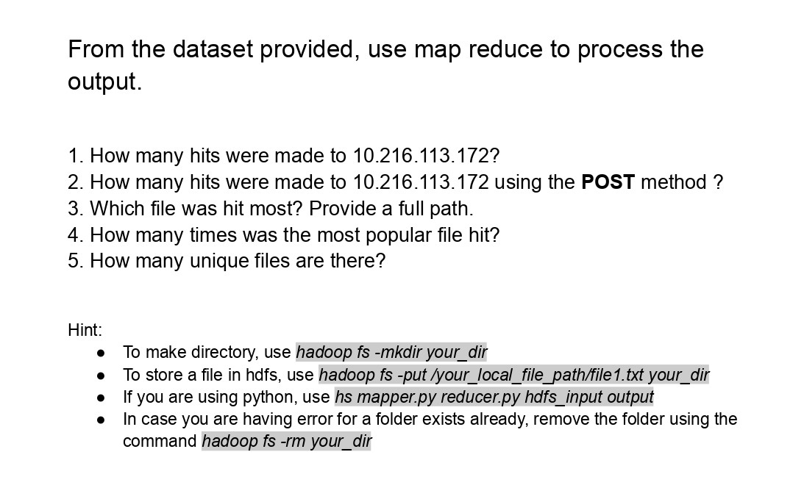

<h1 align="center">Distributed System Lab</h1>

<h2>Assignment - 1 : 20th September, 2023</h2>

**✅Socket Programming (Peer to peer chat application)**
- Create multiple client so that the clients can interact with the server. (*Hint: use Thread Pool*).
- Configure the server so that the clients can talk to each other. (client to client via server)
    - client - webhook - central server - webhook - client
- Resource
    - [Socket Programming Demo](https://github.com/CosmicBeing09/Socket-Programming-Demo)
    - [Java Thread Pool](https://www.javatpoint.com/java-thread-pool) , Socket.io, Webhook
- [⭐**My Socket Assignment**](https://github.com/Sakib62/Socket_Programming)

<h2>Assignment - 2 : 16th October, 2023</h2>

**✅gRPC**
- Producer - Consumer Management System using gRPC
- Registration & **save info in database** (mysql)
- Encrypt password
- Using these info, **user can login**
- Set profile
- View profile
- **Update profile**
- Resources
    - [yrrhelp - gRPC in Java](https://www.youtube.com/playlist?list=PLI5t0u6ye3FGXJMh5kU2RvN0xrul67p7R) and [JDBC in java](https://www.youtube.com/watch?v=sifEAuiVUac)
    - [Tech School - Complete gRPC course](https://www.youtube.com/playlist?list=PLy_6D98if3UJd5hxWNfAqKMr15HZqFnqf)
- [⭐**My gRPC Assignment**](https://github.com/Sakib62/gRPC_Producer_Consumer_Management_System)

 

<blockquote>

~~Message Queue~~
- 3 microservices, layer in middle, implement queue, others subscribe in queue, come later if down
- Rabbit MQ tools, protocol is rpc
- at least 3, async and persistent
</blockquote>

<h2>Lab Final : 23rd January, 2024</h2>

[**⭐Lab Resource⭐**](https://drive.google.com/drive/folders/1kp8zSQVDRBbw6gj0kRymqrbNV2dsrKI5?usp=drive_link) 
[**⭐Hadoop-Docker Setup⭐**](https://github.com/Rifat-Shariar-Sakil-24/Hadoop-Docker)
 [**⭐Github Repo for Demo Code**⭐](https://github.com/CosmicBeing09/Hadoop-Demo-Word-Count-with-Java-and-Maven.git)

Blog
- [Running single node MapReduce using docker and Hadoop Cluster][blog1]
- [Cheetsheet of the custom jar file in Hadoop Cluster][blog2]

[Docker Tutorial](https://youtube.com/playlist?list=PLhW3qG5bs-L99pQsZ74f-LC-tOEsBp2rK)

**1. Quiz**
- On Docker and Hadoop
- [**Quiz Link**](https://drive.google.com/file/d/1LrDVAtax3LOrDEuvccgKIFNk5Ehffmq2/view?usp=drive_link)

**2. Task**
- Execute task on a Hadoop cluster.
- 
- [Dataset](https://drive.google.com/file/d/1jib-_1B81cgm2lUinbMXo6dckyzxQQur/view?usp=drive_link) - Extract it and change the file extension to *txt*

<!--References-->

[blog1]: https://medium.com/@genius_meringue_gnat_79/running-single-node-mapreduce-using-docker-and-hadoop-cluster-41f5ec5b7650
[blog2]: https://medium.com/@genius_meringue_gnat_79/cheetsheet-of-the-custom-jar-file-in-hadoop-cluster-23ee990cfadb