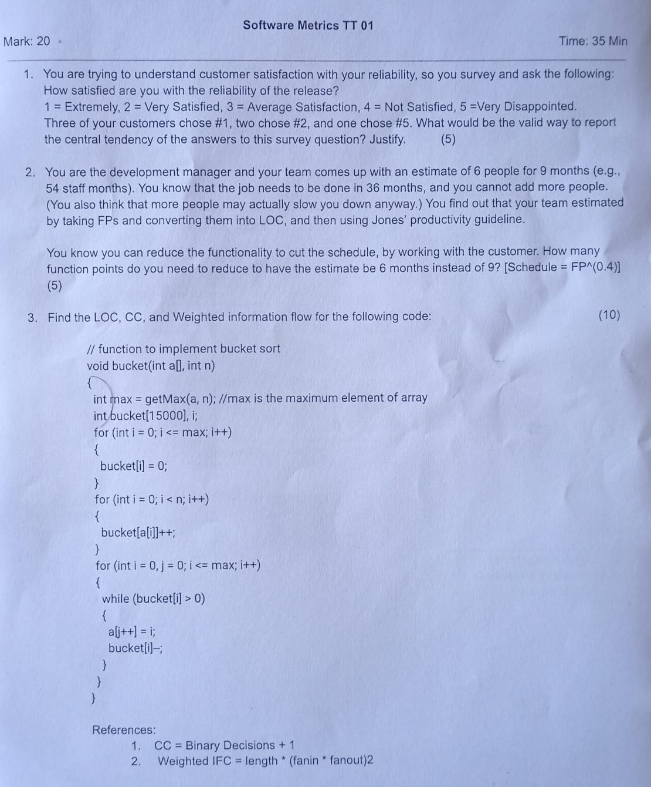
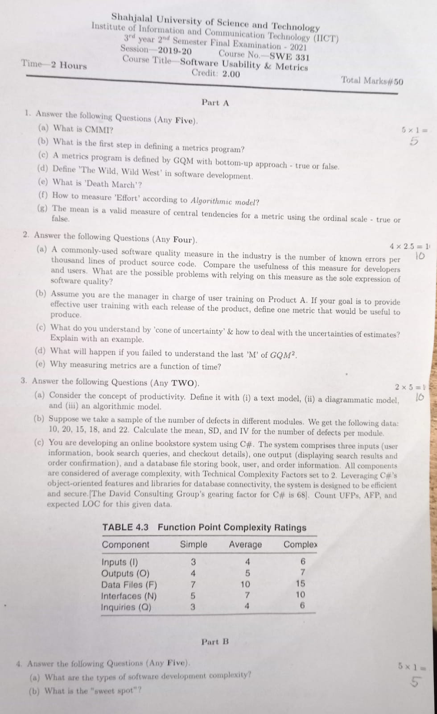
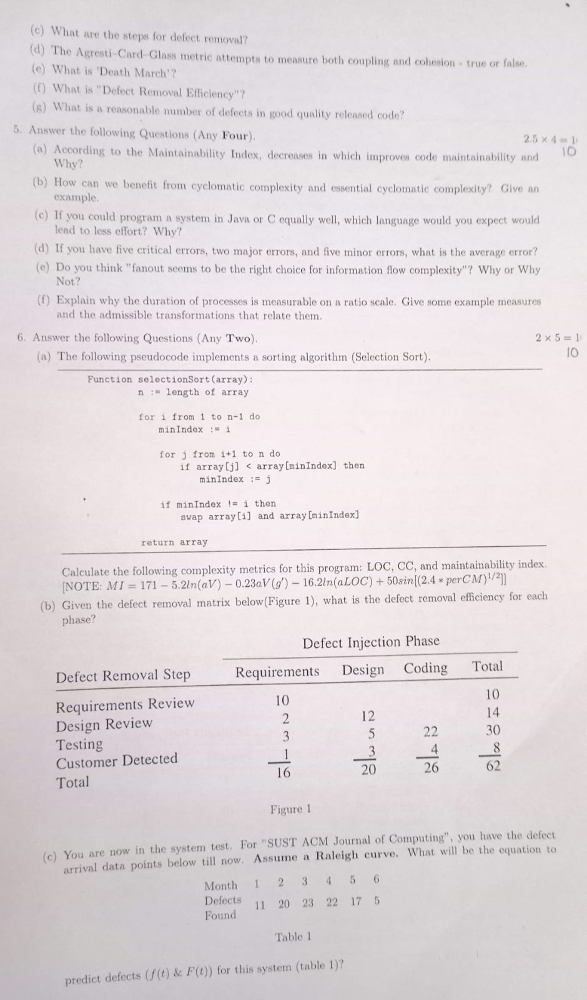

<h1 align="center">Software Usability and Metrics</h1>

<b><u>Term Test-1: 27th November, 2023</u></b>

Chapter 1 to 4
- Ch1 - Introduction
- Ch2 - What to Measure
- Ch3 - Measurement Fundamentals
- Ch4 - Measuring Size

 <h2>Final: 29th November, 2023</h2>

Page 1 :

 Page 2 : 

