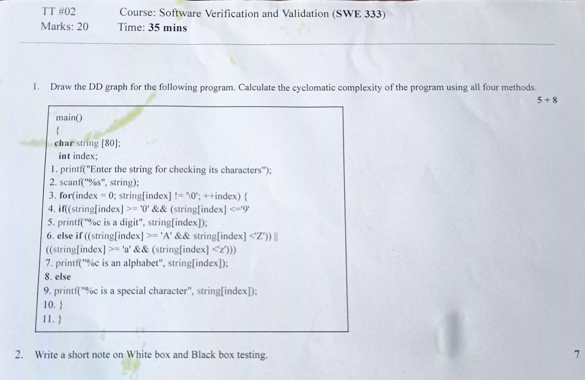
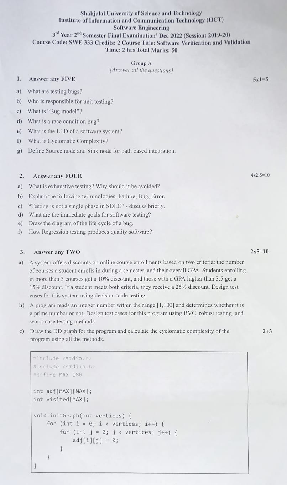
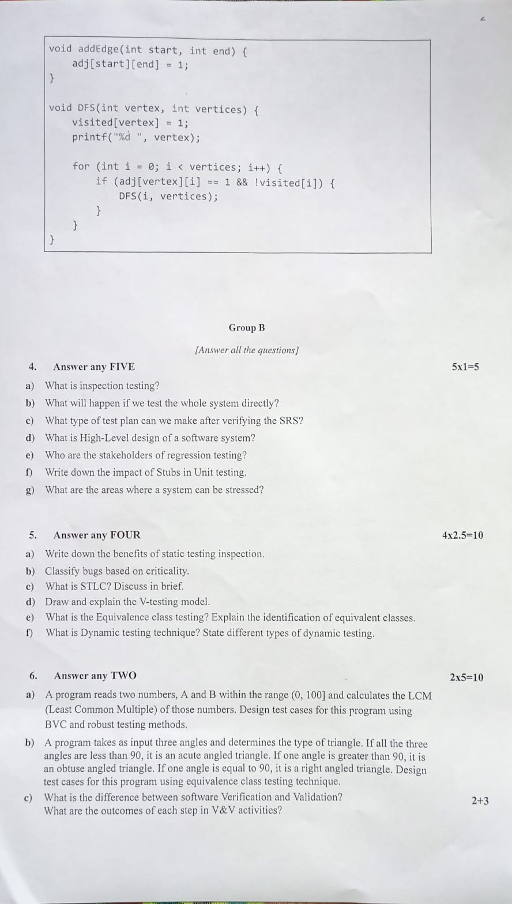

<h1 align="center">Software Verification and Validation Question</h1>

[**Question Collection**](https://drive.google.com/drive/folders/10y4Im4hjRKrbvJ91q6oXPF43gD3y99gK?usp=drive_link)

<b><u>Term Test-1: 20th November, 2023</u></b>

Chapter 1 to 5
- **Ch1 - Introduction to Software Testing**
- **Ch2 - Software Testing Terminology and Methodology**
- **Ch3 - Verification and Validation**
- **Ch4 - Dynamic Testing: Black-Box Testing Techniques**
- **Ch5 - Dynamic Testing: White-Box Testing Techniques**

 <h2>Final: 12th December, 2023</h2>

Chapter 1 to 7
- **Ch6 - Static Testing**
- **Ch7 - Validation Activities**

Page 1 :

 Page 2 : 

