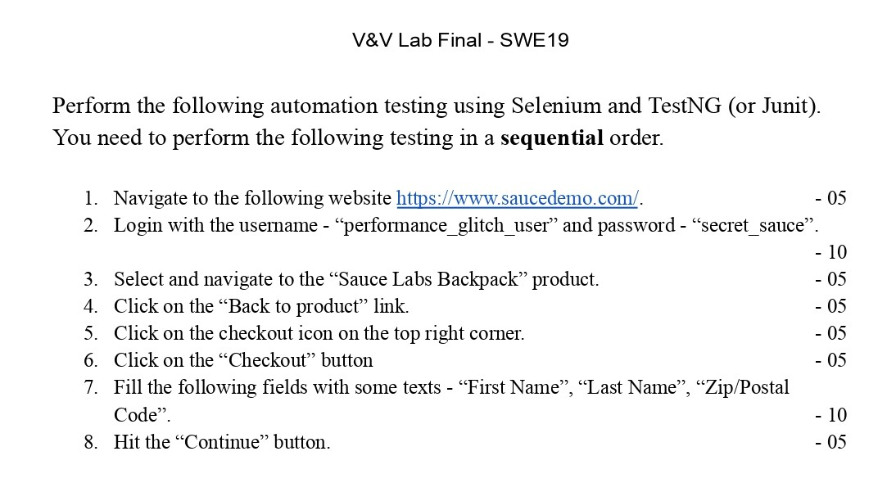
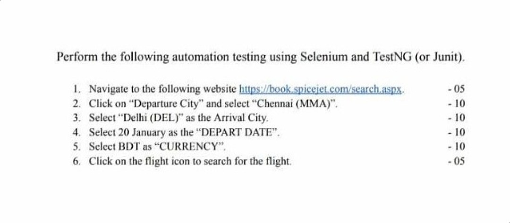

<h1 align="center">Software Verification and Validation Lab</h1>

**Syllabus :**
- Unit Testing - Junit
- Mocking Framework - Mockito
- UI Testing - Test Automation Script
- UI Testing - Selenium WebDriver, Appium
- Stress, Load Testing - Apache Jmeter

**✅Resource :** [**Drive Link**](https://drive.google.com/drive/folders/1tFlzP3hA0_Xv27q6qjMOuaWZ7zo4GXyj?usp=sharing), [Blog](https://medium.com/@AlexanderObregon/getting-started-with-unit-testing-in-intellij-idea-junit-and-mockito-32e1eee739d9), [**Code**](https://gist.github.com/Sakib62/c7f95729e72f8d8611e116ca7ccc4cde)

**✅Documentation :** [**Mockito**](https://javadoc.io/doc/org.mockito/mockito-core/latest/org/mockito/Mockito.html), [**Selenium Web Driver**](https://www.selenium.dev/documentation/webdriver/)

<h2>Lab Class on Unit Testing</h2>

**Unit Testing**
- JUnit
- NUnit
- #Annotation : test, before, after, before class, after class
- #methods :
    - assertEquals(expected, actual)
    - assertTrue(boolean)
    - assertFalse(boolean)
    - assertNull(statement)
- JUnit maven dependency -> in pom file
- manual way -> jar file download

**Mockito**
- external module not ready, but code is dependent on that, so mock that

 <b><u>🔥Lab Final : 17th January, 2024🔥</u></b>

- Quiz on UI Testing and Unit Testing
- Task on UI Testing (may need to use mocking)
- **Lab Task :** 
    
- **Quiz :** [⭐**Question**⭐](https://drive.google.com/file/d/1vWvD4GdizqaihgvNjP3PiDbhj_-Ey5Zs/view?usp=drive_link)

 

**SWE18 - Lab Final :**

- 