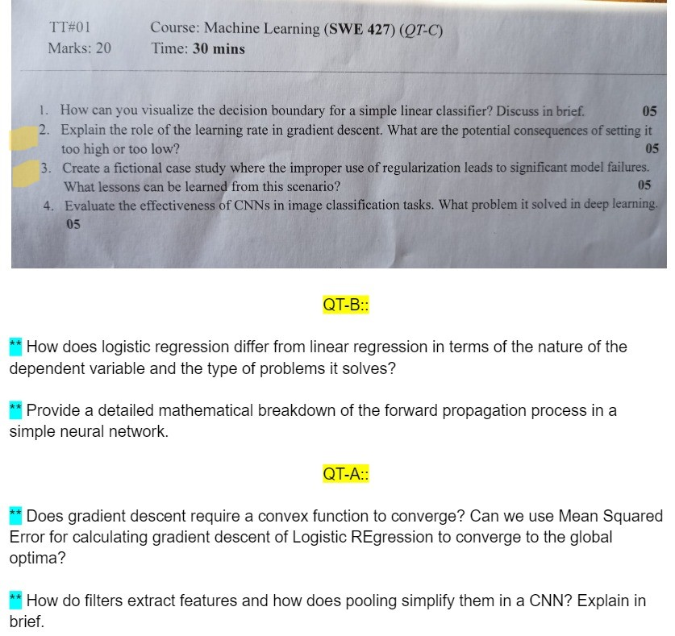
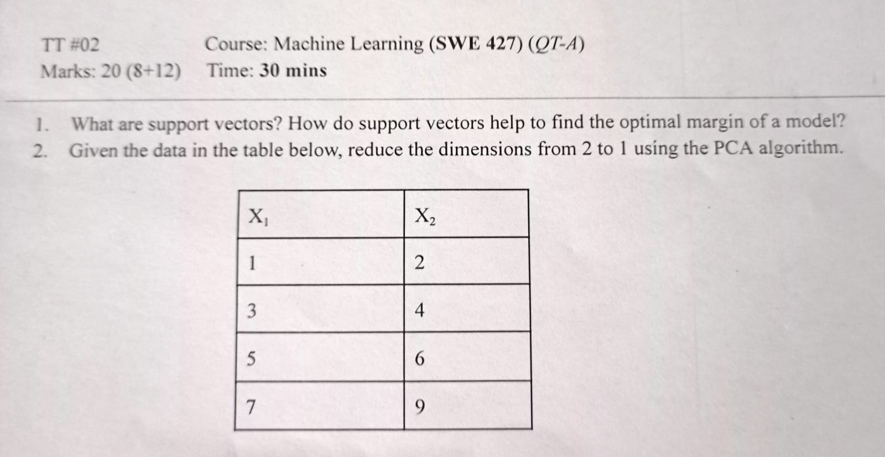
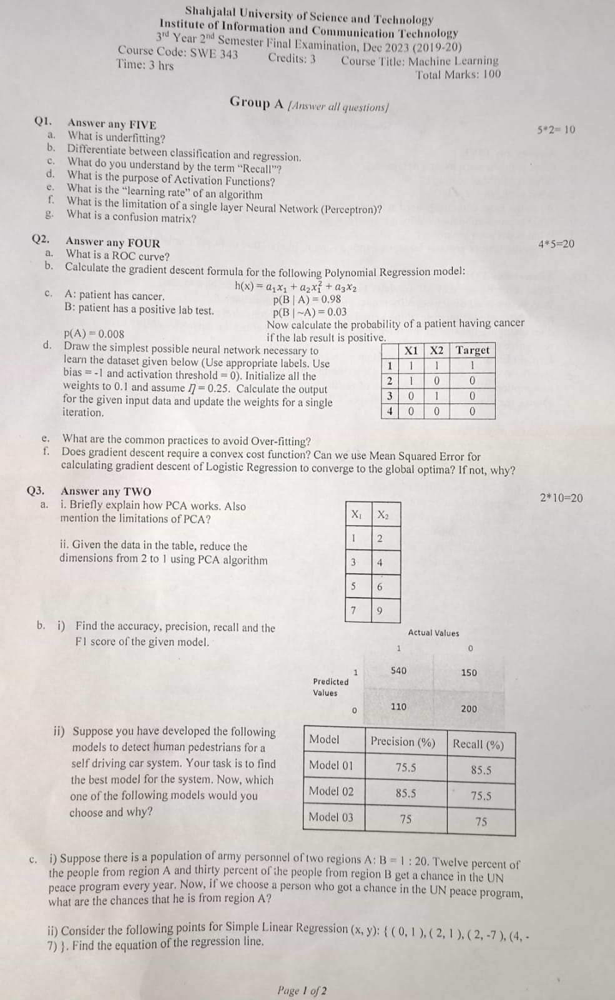
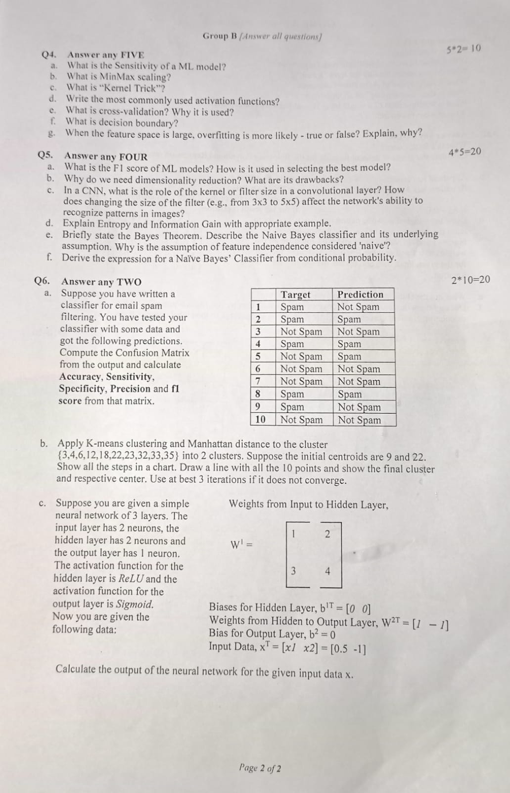

<h1 align="center">Machine Learning Question</h1>

[**Question Collection**](https://drive.google.com/drive/folders/10y4Im4hjRKrbvJ91q6oXPF43gD3y99gK?usp=drive_link)

<b><u>Term Test-1: 11th November, 2023</u></b>

- Linear & Logistic Regression
- Convolutional Neural Network

 <b><u>Term Test-2: 23rd November, 2023</u></b>

- Principle - Component Analysis (PCA)
- SVM + Kernel
- Bayes' Theorem + Naive Bayes

 <h2>Final: 19th December, 2023</h2>

- Supervised Learning
    - Linear & Logistic Regression
    - Classification
    - Cost Function
    - Gradient Descent
    - Underfitting & Overfitting, Regularization
- Unsupervised Learning
    - K-means Clustering
    - Similarity/Distance (Jaccard, Cosine)
- Reinforcement Learning
    - Markov Decision Process
- Neural Network
- Model Evaluation, Confusion Matrix
- SVM - Support Vector Machine, Kernel
- Naive Bayes Theorem
- PCA - Principal Component Analysis

**Page 1 :**

 **Page 2 :** 

