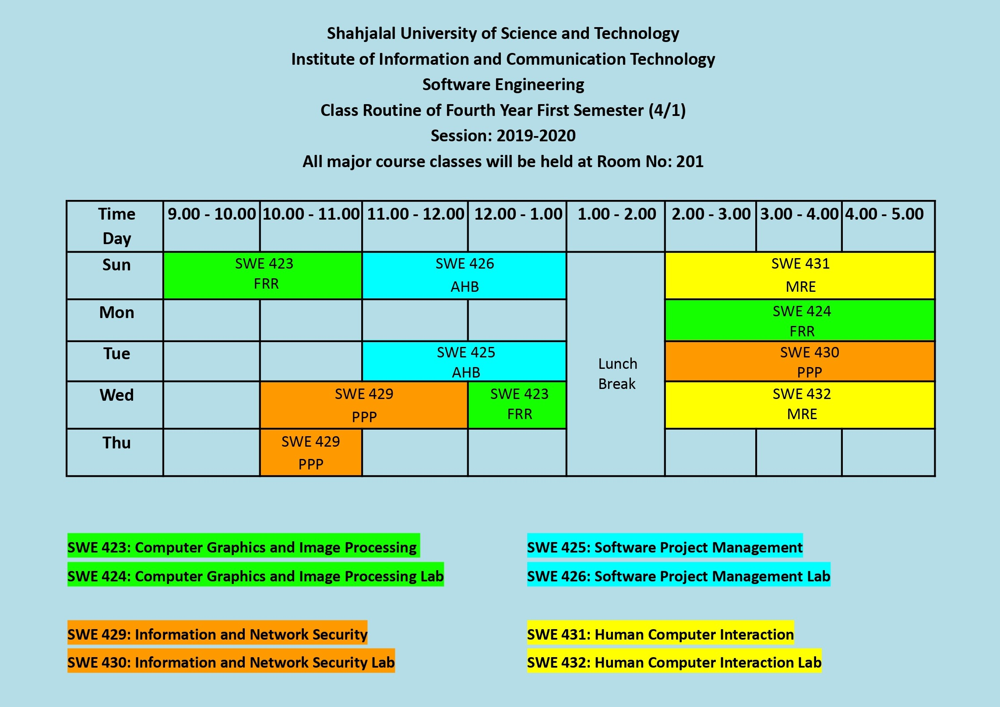

<h2 align = "center">Class Routine</h2> 

 

## [⭐Question⭐][ques]

## [⭐Syllabus⭐][syl]

 

<h2 align = "center"> Final Exam Routine (Theoretical) </h2> 

| Date | Course No. | Course Name|
| :-- | :--: | :-- |
| 25th October, 2024 | SWE 429 | Information and Network Security |
| 27th October, 2024 | SWE 425 | Software Project Management |
| 8th November, 2024 | SWE 423 | Computer Graphics and Image Processing |
| 10th November, 2024 | SWE 431 | Human Computer Interaction |

[ques]: https://drive.google.com/drive/folders/1ZC15wl-kdFYaWfpJuz6E4dKFRavlHaFc
[syl]: https://drive.google.com/file/d/1l1-qBy8Qnq5cST58g5QVlUZOyN33lMsy/view?usp=drive_link