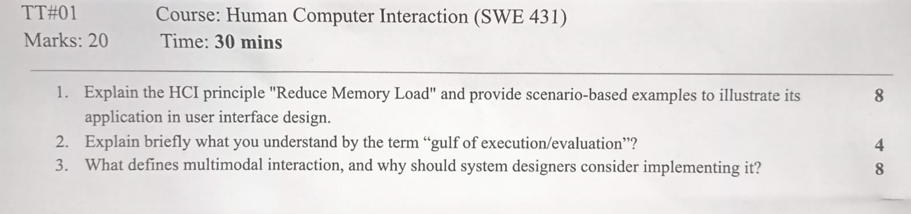
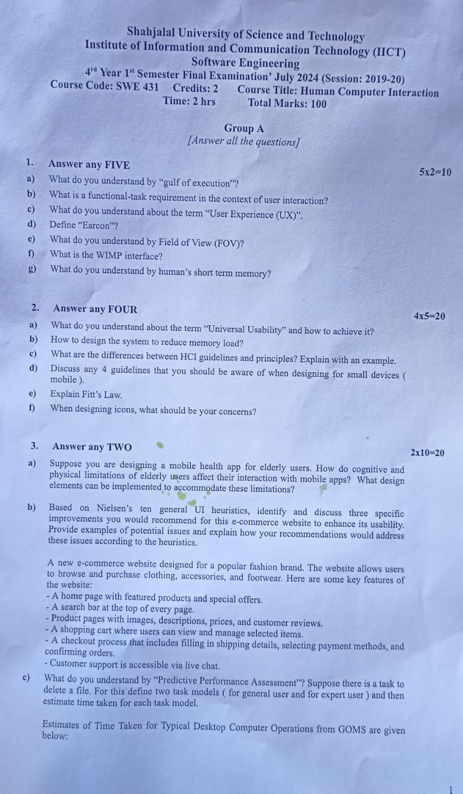
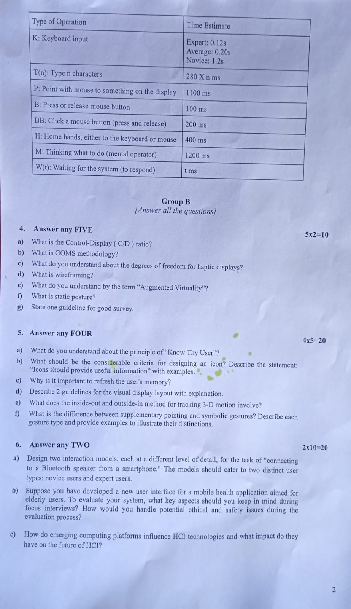

<h1 align="center">Human Computer Interaction - Question</h1>

[**Question Collection**](https://drive.google.com/drive/folders/1ZC15wl-kdFYaWfpJuz6E4dKFRavlHaFc)

<h3>Term Test-1: 7th March, 2024</h3>

- **Chapter 1 - Introduction**
- **Chapter 2 - Specific HCI Guidelines**
- **Chapter 3 - Human Factors as HCI Theories**

 <h2>Final: 10th November, 2024</h2>

Page 1 :

 Page 2 : 

