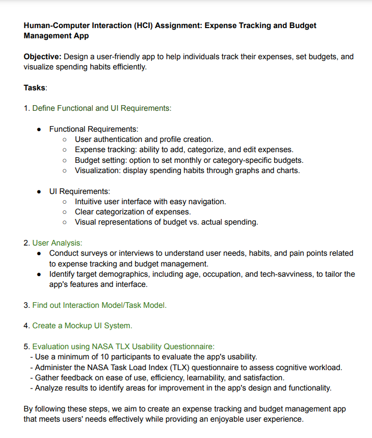

<h1 align="center">Human Computer Interaction - Lab</h1>

[**HCI Lab**](https://drive.google.com/drive/folders/1nQgEFPDJ7i9dDNwxL_w5vtreyNSSFs-X?usp=sharing)

<h3>Lab Final: 21st December, 2024</h3>

✅Figma for prototype, (or might Build a fully functional app).

- user analysis
- task modelling
- user review

